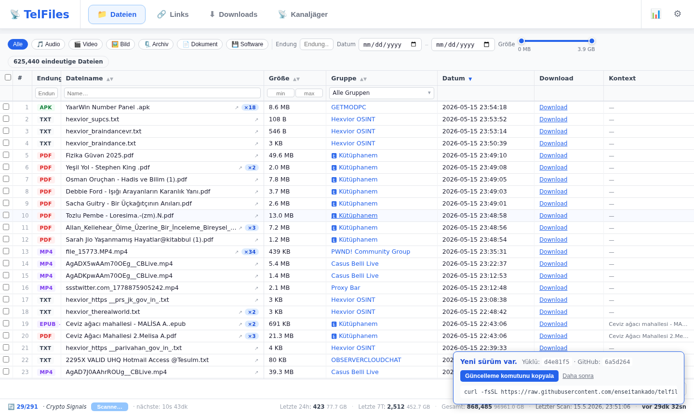
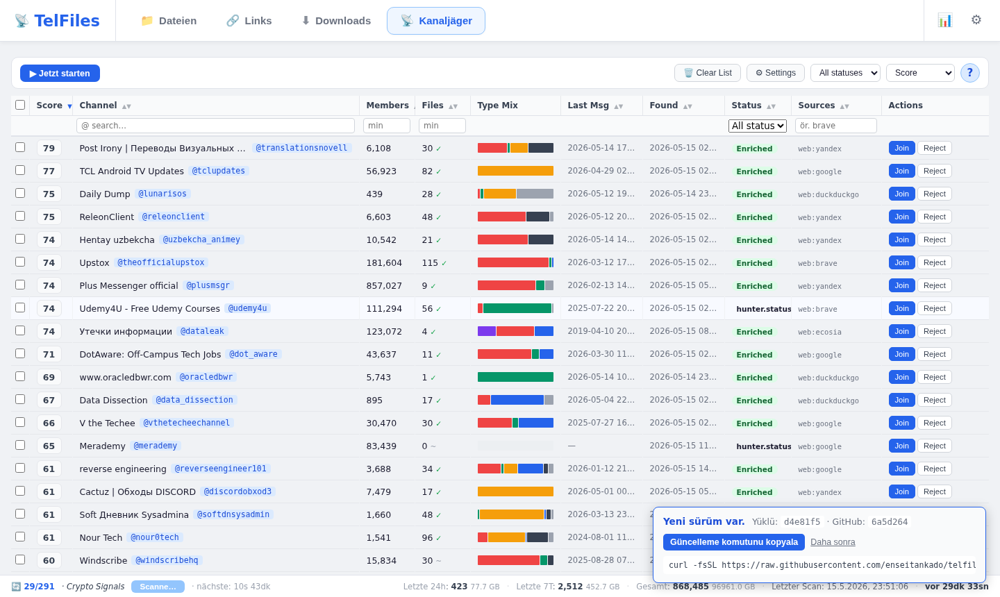
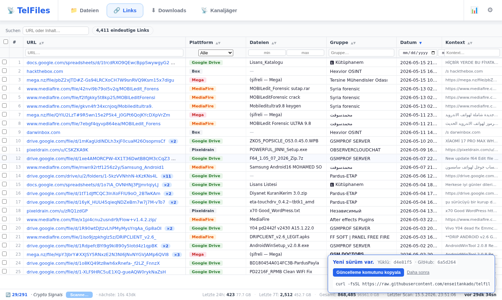
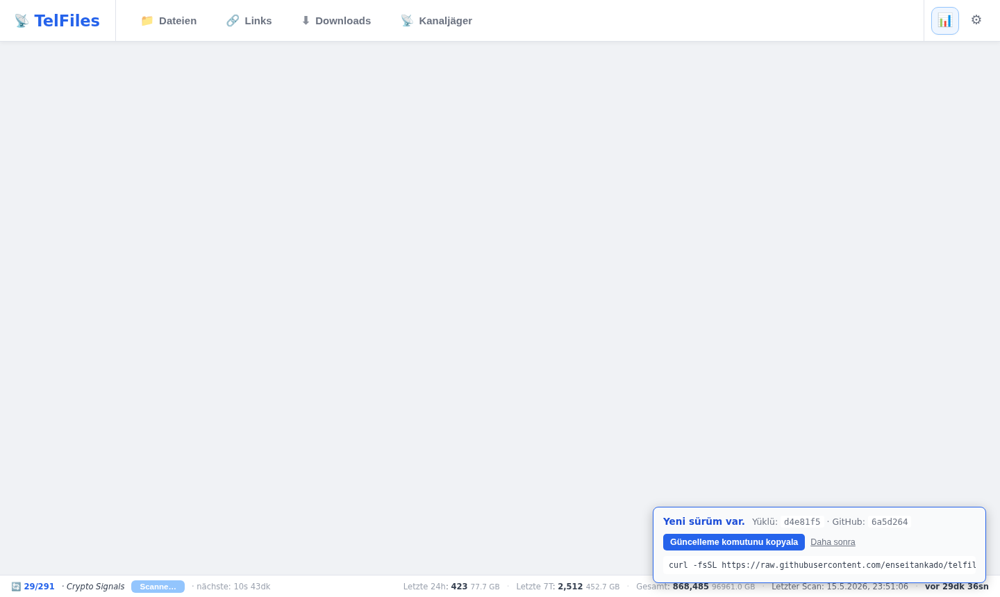
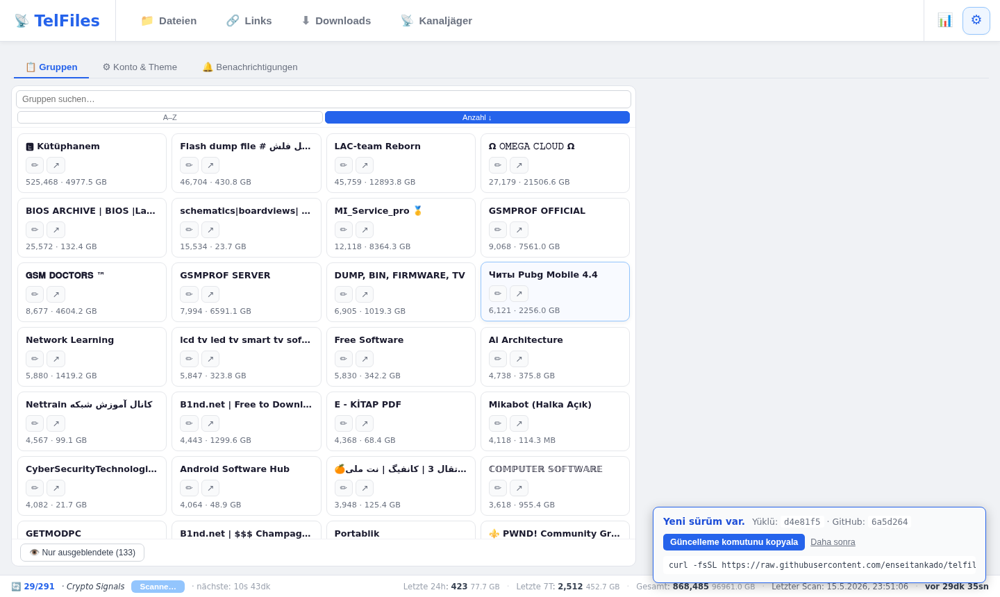

<p align="center">
  
</p>

<p align="center">
  <a href="README.md">🇹🇷 Türkçe</a> &nbsp;|&nbsp;
  <a href="README.en.md">🇬🇧 English</a> &nbsp;|&nbsp;
  <a href="README.de.md">🇩🇪 Deutsch</a> &nbsp;|&nbsp;
  <a href="README.ru.md">🇷🇺 Русский</a> &nbsp;|&nbsp;
  <a href="README.zh.md">🇨🇳 中文</a>
</p>

# TelFiles

Durchsucht mit **Ihrem eigenen Telegram-Konto** im Hintergrund alle beigetretenen Gruppen und Kanäle; indiziert jede gefundene Datei und jeden gefundenen Link in einer lokalen PostgreSQL-Datenbank. Suchen, sortieren, filtern und herunterladen — alles mit einem Klick über eine einzige Browser-Oberfläche.

Bonus: **Kanal-Jäger** — findet neue dateireichhaltige Kanäle, bewertet sie und zeigt die besten an.

```bash
curl -fsSL https://raw.githubusercontent.com/enseitankado/telfiles/main/install.sh | bash
```

> Debian / Ubuntu / Kali / Pardus / Mint. Eine Zeile; installiert Docker falls fehlend, startet die Container und gibt die Zugriffs-URL aus.

---

## ✨ Highlights

- **Multi-Account** — fasst mehrere Telegram-Konten in einer einzigen Ansicht zusammen.
- **Vollständiger Archivzugriff** — paginiert durch den Verlauf und erfasst neue Nachrichten in Echtzeit.
- **Separate Grids für Dateien & Links** — Sortierung + Filter pro Spalte, Eingrenzung nach Kanal / Typ / Größe / Datum.
- **Kanal-Jäger** — 3-stufige Entdeckung: (1) Mining aus internen Links, (2) 22 Webquellen (TGStat, Telemetr.io, Combot, t-do.ru, telega.io + 8 Suchmaschinen + Reddit / HN / GitHub), (3) Anreicherung & Bewertung mit Beispielnachrichten aus Telegram.
- **Erst ausprobieren, dann entscheiden** — Vorschau und Download einer bestimmten Datei aus einem Kandidatenkanal **ohne beizutreten**; führt nur bei ausdrücklicher Bestätigung "temp-join → herunterladen → verlassen" durch.
- **Beobachtungsbegriffe** — Definieren Sie Begriffssets wie `Rechnung 2025`; bei Übereinstimmung mit eingehenden Dateien wird eine Benachrichtigung erstellt (AND-Logik, dateinamenbasiert).
- **Anonyme Telemetrie** — optional; nur Kanal-Username + Mitgliederzahl + Dateianzahl. Keine Nachrichten, IPs oder Identitäten. Mit einem Klick deaktivierbar.
- **5 Sprachen** — Türkçe, English, Deutsch, Русский, 中文.
- **Einmaliges `up -d`** — Docker Compose. Daten liegen in Host-Volumes; das Löschen des Containers lässt Ihre Daten unberührt.

---

## 📸 Screenshots

<table>
<tr>
<td width="50%"><a href="docs/screenshots/de/02-files.png"></a><br><b>📁 Dateien</b> — einheitliche Suche über alle Konten, Typkategorien, Kanalfilter, Größen-Slider.</td>
<td width="50%"><a href="docs/screenshots/de/03-hunter.png"></a><br><b>📡 Kanal-Jäger</b> — Discovery-Pipeline, Sortierung pro Spalte, Dateivorschau in der Detail-Lightbox.</td>
</tr>
<tr>
<td><a href="docs/screenshots/de/04-links.png"></a><br><b>🔗 Links</b> — aus Google Drive / Mega / MediaFire usw. geparste URLs mit Erreichbarkeitsprüfung.</td>
<td><a href="docs/screenshots/de/06-status.png"></a><br><b>📊 Status</b> — Sync-Metriken, Dateityp-Verteilung, plattformbasierte Link-Statistiken, RAM / Festplattennutzung.</td>
</tr>
<tr>
<td colspan="2" align="center"><a href="docs/screenshots/de/05-settings.png"></a><br><b>⚙️ Einstellungen</b> — Gruppenverwaltung, Beobachtungsbegriffe, Sprache & Theme, Passwort.</td>
</tr>
</table>

---

## 🚀 Schnellstart

**Voraussetzungen:** Debian-basiertes Linux + `API_ID` & `API_HASH` von [my.telegram.org](https://my.telegram.org).

```bash
# 1) Einzeiler-Installation
curl -fsSL https://raw.githubusercontent.com/enseitankado/telfiles/main/install.sh | bash

# 2) Skriptgesteuert (CI / vorkonfigurierte Umgebung)
TELEGRAM_API_ID=12345 TELEGRAM_API_HASH=abcdef… NONINTERACTIVE=1 \
  bash -c "$(curl -fsSL https://raw.githubusercontent.com/enseitankado/telfiles/main/install.sh)"

# 3) Manuell
git clone https://github.com/enseitankado/telfiles.git && cd telfiles
cp .env.example .env && $EDITOR .env       # API_ID + API_HASH
docker compose up -d --build
```

Die Zugriffs-URL wird im Terminal ausgegeben (Standard: `http://<host>:8765`). Bei belegtem Port wählt der Installer automatisch den nächsten freien.

### Erster Login — zwei Schritte

1. **Oberflächen-Passwort** — Mit `admin` einloggen, dann unter **Einstellungen → Konto → Oberflächen-Passwort** ändern.
2. **Telegram-Konto** — Einstellungen → Konto → ➕ Konto hinzufügen → Telefon → Code aus Telegram → (falls aktiviert) 2FA. Der Scan startet automatisch nach erfolgreicher Verbindung.

> Wenn `TELEGRAM_API_ID` / `TELEGRAM_API_HASH` leer sind, funktioniert "Code senden" nicht. `.env` ausfüllen und `docker compose restart telfiles-app` ausführen.

### Aktualisierung

Denselben Installationsbefehl erneut ausführen. Der Installer aktualisiert sich selbst, lädt den neuesten Code, baut den Container neu; **`data/` und `pgdata/` bleiben erhalten**.

Beim Start prüft die App den HEAD auf GitHub und benachrichtigt Sie in der Oberfläche bei einer neuen Version.

---

## ⚙️ Konfiguration

| Speicherort | Inhalt | Zurücksetzen |
|---|---|---|
| `data/ui_auth.json` | UI-Passwort-Hash + Sitzungstoken | löschen → kehrt zu `admin` zurück |
| `data/credentials.json` | Telegram-API-Zugangsdaten (hat Vorrang vor env) | löschen → fällt auf `.env` zurück |
| `data/settings.json` | `sync_interval_seconds` (begrenzt auf `[900, 86400]`) | löschen → 7200s |
| `data/accounts/{id}/telfiles.session` | Telethon-Kontositzung | löschen → erneuter Login für dieses Konto erforderlich |
| `data/hunter_events.jsonl` | Jäger-Detailprotokoll (neustartsicher) | löschen → Protokoll geleert |
| `downloads/` | Heruntergeladene Dateien (`<Gruppe>/...` und `_hunter/<Kanal>/...`) | jede Datei einzeln löschbar |
| `pgdata/` | PostgreSQL-Hauptdatenbank | nicht löschen |

### Umgebungsvariablen (`.env`)

| Variable | Erforderlich | Hinweis |
|---|---|---|
| `TELEGRAM_API_ID` | ✅ | my.telegram.org → API Development Tools |
| `TELEGRAM_API_HASH` | ✅ | dieselbe Seite |
| `TELEMETRY_SECRET` | ❌ | Nur wenn Sie Ihren eigenen Telemetrie-Server betreiben |

---

## 🧱 Stack

| Schicht | Technologie |
|---|---|
| Backend | Python 3.12 · FastAPI · Uvicorn · asyncio |
| Telegram | [Telethon](https://github.com/LonamiWebs/Telethon) (MTProto) |
| Daten | PostgreSQL 16 · asyncpg |
| Web-Scraping | aiohttp + [CloakBrowser](https://github.com/cloakbrowser) (Stealth Chromium, Stufe 2) |
| Frontend | Vanilla JS · CSS · HTML (kein Build-Schritt) |
| Deployment | Docker Compose |

Container-Image **~302 MB**. Alle Laufzeitzustände in Host-Volumes.

---

## 🗂️ Projektstruktur

```
app/
├── main.py              # FastAPI + Endpunkte + 4 Hintergrundschleifen
├── database.py          # asyncpg-Datenschicht + Schema-Migrationen
├── telegram_client.py   # Multi-Account-Telethon-Verwaltung
├── sync.py              # Verlaufs- + Echtzeit-Nachrichten-Scanner
├── hunter.py            # Kanal-Jäger-Pipeline + Datei-Download
├── link_prober.py       # Link-Erreichbarkeitsprüfer
├── telemetry.py         # Anonymer Statistik-Sender
├── ui_auth.py           # Web-Passwort + Sitzung
└── static/              # index.html, app.js, i18n.js — Single-Page-UI

docs/
├── banner.png           # README-Header
├── screenshots/         # UI-Screenshots (Sprachordner: tr/en/de/ru/zh)
└── OPERATOR.md          # DB-Abfragen, Fehlerbehebung, Jäger-Quellen
```

---

## 🛠️ Entwicklung

```bash
# Backend (Python)-Änderung → Rebuild erforderlich
docker compose up -d --build telfiles-app

# Frontend (HTML/JS/CSS) → bind-mount; Browser einfach neu laden
# app/static/* wird live vom Host bereitgestellt

# Logs / DB
docker logs -f telfiles-app
docker exec -it telfiles-postgres psql -U telfiles -d telfiles
```

Mehr: [docs/OPERATOR.md](docs/OPERATOR.md) — DB-Abfragen, Jäger-Quellenliste, häufige Probleme → Lösungstabelle.

---

## 🔒 Datenschutz & Telemetrie

Wenn aktiviert, werden **einmal alle 24 Stunden** nur diese drei Felder gesendet:

- Der **Benutzername** der beigetretenen Kanäle (bereits öffentliche Telegram-Information)
- Die **Mitgliederzahl** jedes Kanals (ebenfalls öffentlich)
- Die **Anzahl der indizierten Dateien** aus diesem Kanal

**Niemals gesendet:** Nachrichten, Dateinamen, Dateiinhalte, Telefonnummer, Kontodaten, IP.

Kennung: eine zufällig lokal bei der Installation generierte UUID. Deaktivieren: Einstellungen → Konto → "Nutzungsstatistiken senden" deaktivieren.

Für einen eigenen Empfänger-Endpunkt `ENDPOINT_URL` in `app/telemetry.py` ändern.

---

## 🤝 Probleme & Beiträge

Über [GitHub Issues](https://github.com/enseitankado/telfiles/issues).

---

## ⚖️ Lizenz

Dieses Projekt ist Open Source; alle Rechte verbleiben beim Autor bis eine Lizenzdatei hinzugefügt wird. Bitte Kontakt aufnehmen für Fork / Änderung / Weiterverbreitung.

---

## ⚠️ Haftungsausschluss

TelFiles indiziert ausschließlich Inhalte, auf die **Sie über Ihr eigenes Telegram-Konto bereits Zugriff haben**. Die Einhaltung der [Nutzungsbedingungen](https://telegram.org/tos) von Telegram liegt in der Verantwortung des Benutzers. Die Autoren haften nicht für Folgen, die aus dem Missbrauch dieses Tools entstehen.
