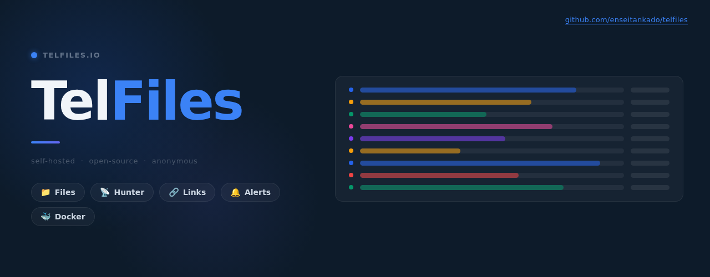
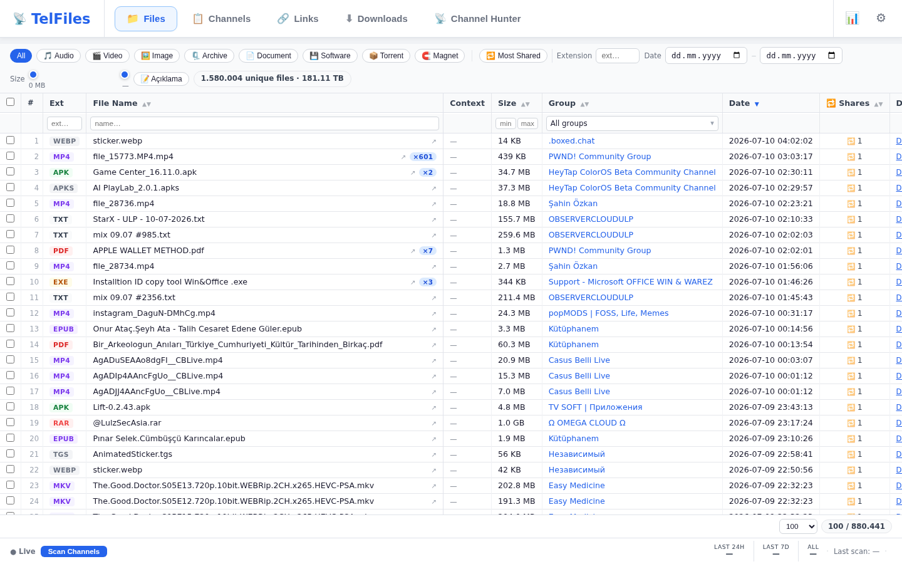
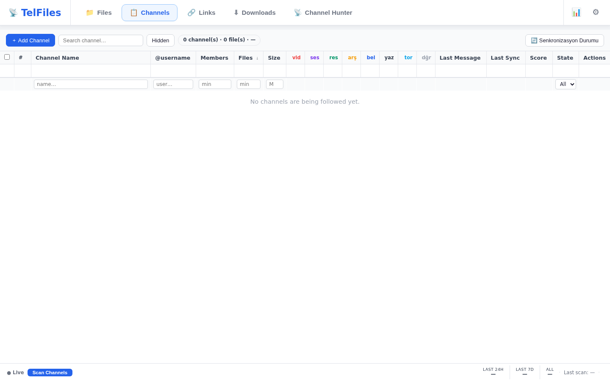
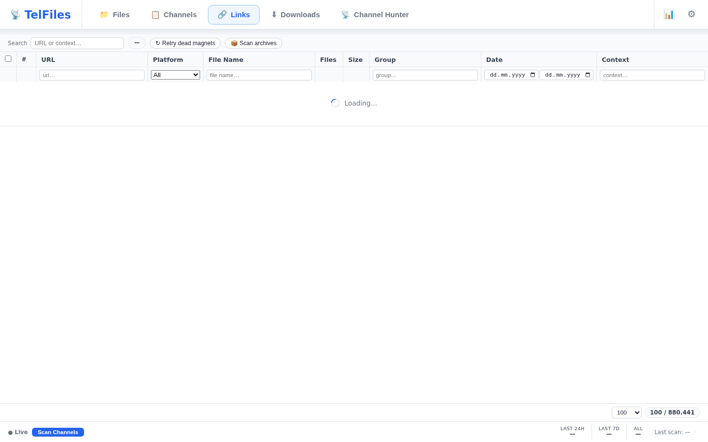
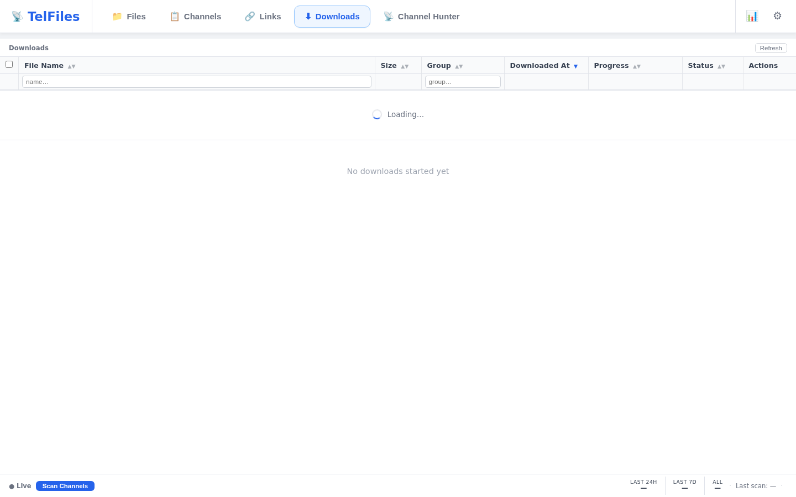
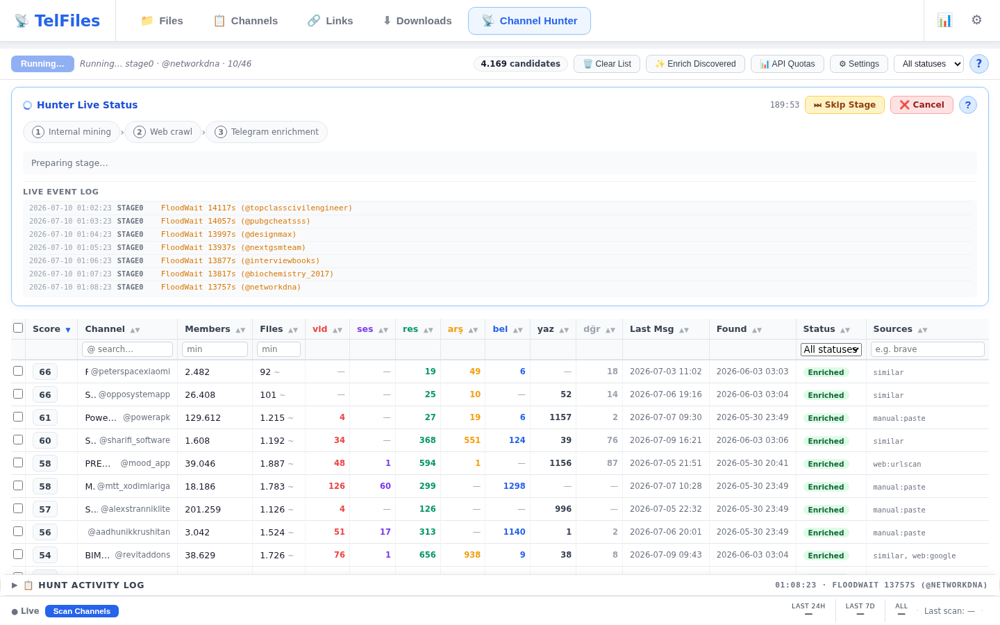
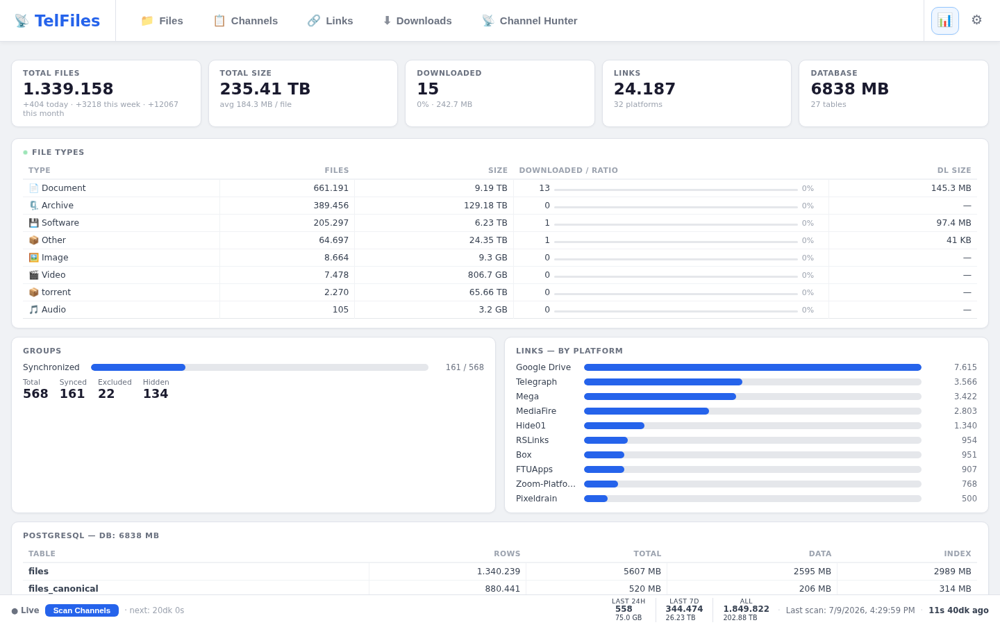
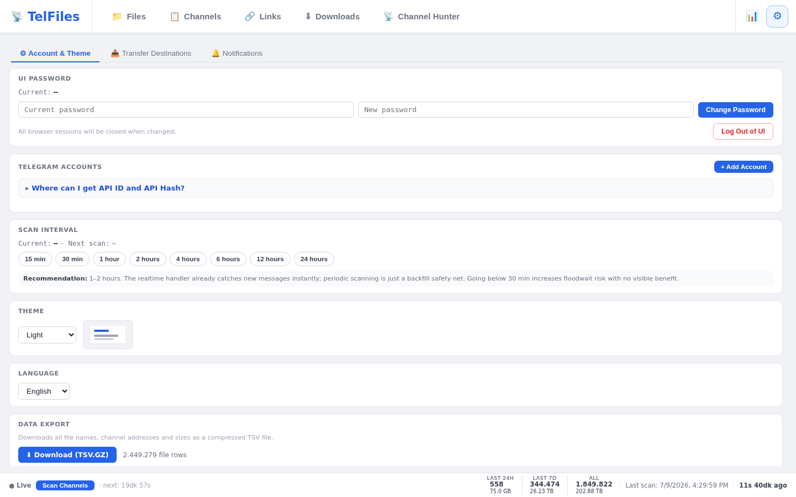

<p align="center">
  
</p>

<p align="center">
  <a href="README.md">🇹🇷 Türkçe</a> &nbsp;|&nbsp;
  <a href="README.en.md">🇬🇧 English</a> &nbsp;|&nbsp;
  <a href="README.de.md">🇩🇪 Deutsch</a> &nbsp;|&nbsp;
  <a href="README.ru.md">🇷🇺 Русский</a> &nbsp;|&nbsp;
  <a href="README.zh.md">🇨🇳 中文</a>
</p>

# TelFiles

Uses **your own Telegram account** to crawl groups and channels you have joined in the background; indexes every file and every link it encounters into a local PostgreSQL database. Search, sort, filter, and download anything with a single click from one browser interface.

Bonus: **Channel Hunter** — discovers new file-rich channels, scores them, and surfaces the best ones.

```bash
curl -fsSL https://raw.githubusercontent.com/enseitankado/telfiles/main/install.sh | bash
```

> Debian / Ubuntu / Kali / Pardus / Mint. One line; installs Docker if missing, brings up the containers, and prints the access URL.

---

## ✨ Highlights

- **Multi-account** — combines multiple Telegram accounts into a single view.
- **Full archive access** — paginates through history and captures new messages in real time.
- **Separate grids for Files, Links & Channels** — per-column sorting + filters, narrow by channel / type / size / date; the Channels tab shows member counts, file counts, supports bulk operations, and shift-click range selection on checkboxes.
- **Torrent content index** — `.torrent` files are parsed automatically; their internal file paths are added to the database and included in the full-text search on the Files tab. Large archives are capped at 1,000 displayed entries with a remaining-count notice.
- **Semantic search** — optional pgvector integration; file names are embedded with a local model so results can be ranked by meaning, not just keyword match.
- **Downloads & Transfer** — downloaded files are tracked in a history tab with local-path hover tooltips and a one-click "delete all" to reclaim disk space. Stored files can be automatically copied or moved to FTP, SFTP, or a local directory (NAS / external drive). **Bandwidth scheduling** lets large files download only during hours you specify. Destination preferences are remembered across sessions.
- **Channel Hunter** — 3-stage discovery: (1) mining from internal links, (2) 22+ web sources (TGStat, Telemetr.io, Combot, t-do.ru, telega.io + search engines + Reddit / HN / GitHub + web archives), (3) enrichment & scoring with sample messages from Telegram. Server-side per-column sorting; temporary membership to scan restricted channels; automatic skipping of channels whose newest file is over a year old.
- **Try before you commit** — preview and download a specific file from a candidate channel **without joining**; only performs "temp-join → download → leave" when you explicitly approve.
- **Magnet links** — `magnet:` URIs are parsed, metadata (title, size, tracker list) is fetched; bulk backfill updates existing links.
- **Watch keywords** — define term sets like `invoice 2025`; a notification is created when a matching file arrives (AND logic, filename-based).
- **In-app update notifications** — on every startup the app checks the latest commit on GitHub and shows a banner with a one-click copy of the update command when a new version is available.
- **Safe schema migrations** — a versioned `schema_migrations` table tracks every applied change; breaking alterations (type changes, renames, drops) run in their own transaction and the app refuses to start if one fails, so data is never left in a partial state.
- **PWA** — installable on mobile or desktop via "Add to Home Screen"; supports basic offline UI.
- **Anonymous telemetry** — optional; only channel username + member count + file count. No messages, IPs, or identities. One click to disable.
- **5 languages** — Türkçe, English, Deutsch, Русский, 中文.
- **Single `up -d`** — Docker Compose. Data lives in host volumes; deleting the container leaves your data intact.

---

## 📸 Screenshots

<table>
<tr>
<td width="50%"><a href="docs/screenshots/en/02-files.png"></a><br><b>📁 Files</b> — unified search across all accounts, type categories, channel filter, size slider; torrent content expansion.</td>
<td width="50%"><a href="docs/screenshots/en/01-channels.png"></a><br><b>📋 Channels</b> — followed channels with file counts, member counts, per-column sorting, bulk actions, and shift-click range selection.</td>
</tr>
<tr>
<td><a href="docs/screenshots/en/04-links.png"></a><br><b>🔗 Links</b> — URLs parsed from Google Drive / Mega / MediaFire etc., magnet metadata, torrent archive inspector, accessibility checks.</td>
<td><a href="docs/screenshots/en/05-downloads.png"></a><br><b>⬇ Downloads</b> — tracked download history with progress, local-path tooltips, one-click delete; transfer to FTP / SFTP / local dir.</td>
</tr>
<tr>
<td><a href="docs/screenshots/en/03-hunter.png"></a><br><b>📡 Channel Hunter</b> — 3-stage discovery pipeline, server-side per-column sorting, file preview and temp-join download in the detail lightbox.</td>
<td><a href="docs/screenshots/en/06-status.png"></a><br><b>📊 Status</b> — sync metrics, file type distribution, platform-based link stats, PostgreSQL table sizes, activity heatmap.</td>
</tr>
<tr>
<td colspan="2" align="center"><a href="docs/screenshots/en/07-settings.png"></a><br><b>⚙️ Settings</b> — Telegram accounts, scan interval, theme, language, transfer destinations, bandwidth scheduling, watch keywords, password.</td>
</tr>
</table>

---

## 🚀 Quick start

**Requirements:** Debian-based Linux + `API_ID` & `API_HASH` from [my.telegram.org](https://my.telegram.org).

```bash
# 1) One-liner install
curl -fsSL https://raw.githubusercontent.com/enseitankado/telfiles/main/install.sh | bash

# 2) Scripted (CI / pre-configured env)
TELEGRAM_API_ID=12345 TELEGRAM_API_HASH=abcdef… NONINTERACTIVE=1 \
  bash -c "$(curl -fsSL https://raw.githubusercontent.com/enseitankado/telfiles/main/install.sh)"

# 3) Manual
git clone https://github.com/enseitankado/telfiles.git && cd telfiles
cp .env.example .env && $EDITOR .env       # API_ID + API_HASH
docker compose up -d --build
```

The access URL is printed to the terminal (default: `http://<host>:8765`). If the port is taken the installer automatically picks the next available one.

### First login — two steps

1. **Interface password** — log in with `admin`, then change it under **Settings → Account → Interface Password**.
2. **Telegram account** — Settings → Account → ➕ Add Account → phone → code sent to Telegram → (if enabled) 2FA. Scanning starts automatically once connected.

> If `TELEGRAM_API_ID` / `TELEGRAM_API_HASH` are empty, "Send code" will not work. Fill in `.env` and run `docker compose restart telfiles-app`.

### Updating

Run the same install command again. The installer updates itself, pulls the latest code, rebuilds the container; **`data/` and `pgdata/` are preserved**.

On startup the app checks the HEAD on GitHub and notifies you in the UI if a new version is available.

**Database schema migrations** are applied automatically on every startup. A `schema_migrations` table tracks which versions have already run. Additive changes (new tables, new columns) are idempotent and always safe. Destructive changes (column type changes, renames, drops) are versioned migrations that each run in their own transaction — if one fails, the app refuses to start and logs the exact error so you can act before any data is touched.

Migrations must be written defensively so they are safe on both fresh installs (where `_SCHEMA` already created the final state) and existing installs (where the schema is still in the old state). Use a `DO $$ BEGIN … END $$;` guard that checks whether the change is still needed before applying it:

```sql
-- Safe column rename (idempotent on both old and new installs)
DO $$ BEGIN
  IF EXISTS (
    SELECT 1 FROM information_schema.columns
    WHERE table_name = 'files' AND column_name = 'context'
  ) THEN
    ALTER TABLE files RENAME COLUMN context TO caption;
  END IF;
END $$;

-- Safe column type change
DO $$ BEGIN
  IF (SELECT data_type FROM information_schema.columns
      WHERE table_name = 'files' AND column_name = 'file_size') = 'bigint' THEN
    ALTER TABLE files ALTER COLUMN file_size TYPE NUMERIC USING file_size::NUMERIC;
  END IF;
END $$;
```

---

## ⚙️ Configuration

| Location | Contents | Reset |
|---|---|---|
| `data/ui_auth.json` | UI password hash + session tokens | delete → reverts to `admin` |
| `data/credentials.json` | Telegram API credentials (takes precedence over env) | delete → falls back to `.env` |
| `data/settings.json` | `sync_interval_seconds` (clamped to `[900, 86400]`) | delete → 7200s |
| `data/accounts/{id}/telfiles.session` | Telethon account session | delete → re-login required for that account |
| `data/hunter_events.jsonl` | Hunter detail log (restart-safe) | delete → log cleared |
| `downloads/` | Downloaded files (`<group>/...` and `_hunter/<channel>/...`) | each file can be deleted independently |
| `pgdata/` | PostgreSQL main database | do not delete |

### Environment variables (`.env`)

| Variable | Required | Note |
|---|---|---|
| `TELEGRAM_API_ID` | ✅ | my.telegram.org → API Development Tools |
| `TELEGRAM_API_HASH` | ✅ | same page |
| `TELEMETRY_SECRET` | ❌ | Only if you run your own telemetry server |

---

## 🧱 Stack

| Layer | Technology |
|---|---|
| Backend | Python 3.12 · FastAPI · Uvicorn · asyncio |
| Telegram | [Telethon](https://github.com/LonamiWebs/Telethon) (MTProto) |
| Data | PostgreSQL 16 · asyncpg · pgvector |
| Web scraping | aiohttp + [CloakBrowser](https://github.com/cloakbrowser) (stealth Chromium, Stage 2) |
| Frontend | Vanilla JS · CSS · HTML (no build step) |
| Deployment | Docker Compose |

Container image **~302 MB**. All runtime state is in host volumes.

---

## 🗂️ Project structure

```
app/
├── main.py              # FastAPI + endpoints + background loops
├── database.py          # asyncpg data layer + schema migrations
├── telegram_client.py   # Multi-account Telethon management
├── sync.py              # History + realtime message scanner
├── hunter.py            # Channel Hunter pipeline + per-file download
├── link_prober.py       # Link accessibility checker
├── transfer.py          # FTP / SFTP / local directory transfer engine
├── embed.py             # pgvector semantic embedding API
├── embed_worker.py      # Background embedding worker
├── magnet_metadata.py   # Magnet URI metadata fetcher
├── torrent_parse.py     # .torrent file parser
├── telemetry.py         # Anonymous stats sender
├── ui_auth.py           # Web password + session
└── static/              # index.html, app.js, i18n.js — single-page UI

docs/
├── banner.png           # README header
├── screenshots/         # UI screenshots (language folders: tr/en/de/ru/zh)
└── OPERATOR.md          # DB queries, troubleshooting, hunter sources
```

---

## 🛠️ Development

```bash
# Backend (Python) change → rebuild required
docker compose up -d --build telfiles-app

# Frontend (HTML/JS/CSS) → bind-mount; just refresh the browser
# app/static/* is served live from the host

# Logs / DB
docker logs -f telfiles-app
docker exec -it telfiles-postgres psql -U telfiles -d telfiles
```

More: [docs/OPERATOR.md](docs/OPERATOR.md) — DB queries, hunter source list, common issue → fix table.

---

## 🔒 Privacy & Telemetry

When enabled, **once every 24 hours**, only these three fields are sent:

- The **username** of channels you have joined (already public Telegram info)
- Each channel's **member count** (also public)
- The **number of files** you have indexed from that channel

**Never sent:** messages, filenames, file contents, phone number, account details, IP.

Identifier: a random UUID generated locally at install time. To disable: Settings → Account → uncheck "Send usage statistics".

To use your own receiver endpoint, change `ENDPOINT_URL` in `app/telemetry.py`.

---

## 🤝 Issues & contributions

Via [GitHub Issues](https://github.com/enseitankado/telfiles/issues).

---

## ⚖️ License

This project is open source; all rights reserved by the author until a license file is added. Please get in touch for fork / modification / redistribution.

---

## ⚠️ Disclaimer

TelFiles only indexes content you **already have access to via your own Telegram account**. Complying with Telegram's [Terms of Service](https://telegram.org/tos) is the user's responsibility. The author(s) are not liable for any consequences arising from misuse of this tool.
