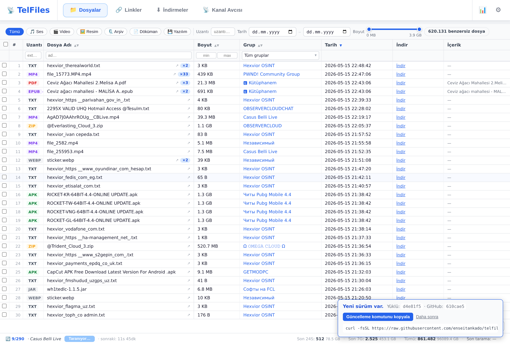
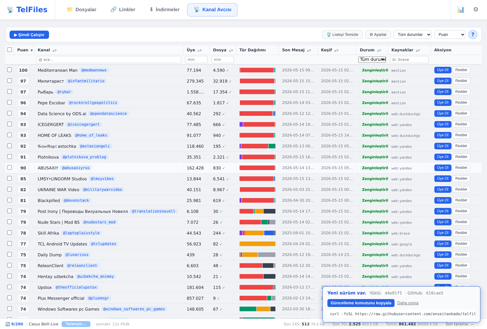
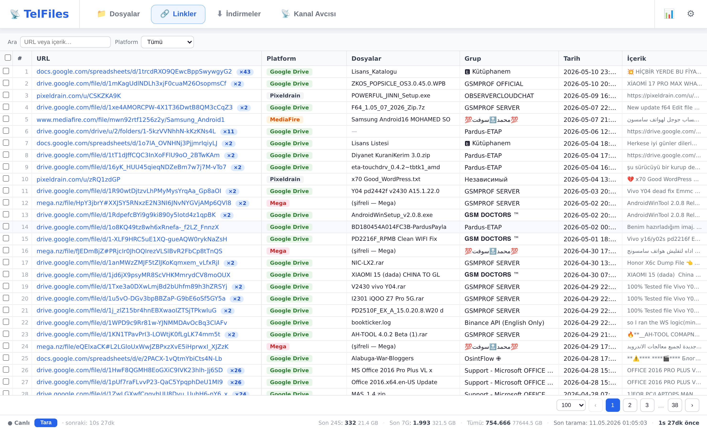
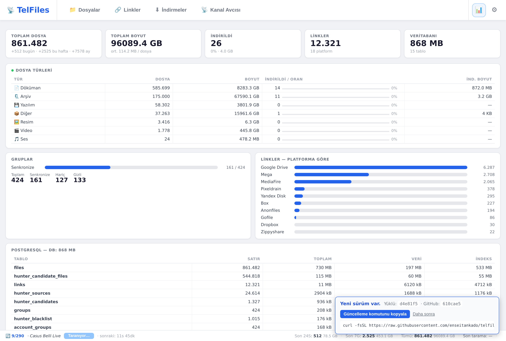
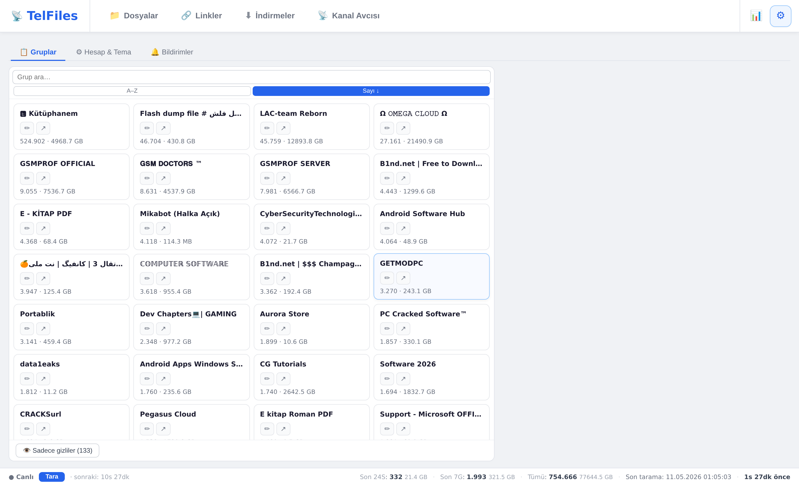

# TelFiles

TelFiles, **Telegram'daki grup ve kanallarda paylaşılan dosyaları ve bağlantıları sizin için tek bir yerde toplayan** bir programdır. Kendi bilgisayarınızda çalışır; topladığı bilgileri başka kimseyle paylaşmaz.

Telegram hesabınızla giriş yaptığınızda, üyesi olduğunuz tüm grup ve kanalları arka planda tek tek gezer. Karşılaştığı her dosyayı (adı, boyutu, türü) ve her bağlantıyı kendi listenize ekler. Sonra tarayıcınızdan bu listeyi açıp arama yapabilir, sıralayabilir ve istediğiniz dosyayı tek tıkla bilgisayarınıza indirebilirsiniz.

İlgilendiğiniz kelimeleri önceden tanımlarsanız (örneğin "fatura 2025"), o kelimeler bir dosya adında geçtiğinde program size haber verir; siz kanalları tek tek takip etmek zorunda kalmazsınız.

Ayrıca **Kanal Avcısı** adlı bir özellik, sizin için yeni ve dosya bakımından zengin kanallar arar: hâlihazırda üye olduğunuz kanallardaki ipuçlarından ve internetteki açık Telegram dizinlerinden hareketle aday kanal listesi çıkarır, her birini puanlar ve "katılayım mı?" diye size sunar.

```bash
curl -fsSL https://raw.githubusercontent.com/enseitankado/telfiles/main/install.sh | bash
```

> Debian/Ubuntu/Kali — tüm bağımlılıkları kurar, container'ları ayağa kaldırır, erişim URL'sini ve `admin` parolasını yazdırır. Ayrıntı için [Hızlı başlangıç](#-hızlı-başlangıç).

---

## ✨ Özellikler

- **Çoklu hesap** — birden fazla Telegram hesabı ekleyip aynı veritabanı altında birleştirilmiş bir görünüm elde edin.
- **Dosya & bağlantı indeksleme** — geçmiş mesajlardan tüm dosya ve linkleri arka planda toplar; yeni gelenler gerçek zamanlı olarak yakalanır.
- **Hızlı arama** — ad, tip, boyut, kanal, tarih bazlı filtre + sıralama.
- **Kanal Avcısı** — TGStat, Telemetr.io, Combot, tdirectory, tlgrm, çeşitli search engine ve Telegram dizinleri üzerinden dosya bakımından zengin yeni kanalları otomatik keşfeder, skorlar ve "katıl" kuyruğuna ekler.
- **İzleme kelimeleri** — dosya adlarında belirli kelime kombinasyonları görüldüğünde bildirim üretir (AND mantığı).
- **İndirici** — UI'dan tek tıkla dosyaları yerel diske indirir; eş zamanlı indirme kuyruğu ve duraklat/devam et desteği.
- **Çok dilli arayüz** — Türkçe, İngilizce, Almanca, Rusça, Çince.
- **Tek dosya Docker Compose dağıtımı** — `up -d` yeter.

---

## 📸 Ekran görüntüleri

<table>
<tr>
<td width="50%"><a href="docs/screenshots/02-files.png"></a><br><b>📁 Dosyalar</b> — tüm hesaplardan birleştirilmiş arama, çoklu filtre, tip kategorileri.</td>
<td width="50%"><a href="docs/screenshots/03-hunter.png"></a><br><b>📡 Kanal Avcısı</b> — yeni file-rich kanalların otomatik keşfi, skorlama, derin tarama.</td>
</tr>
<tr>
<td><a href="docs/screenshots/04-links.png"></a><br><b>🔗 Linkler</b> — Google Drive, Mega, MediaFire ve onlarca platformdan parse edilmiş bağlantılar.</td>
<td><a href="docs/screenshots/06-status.png"></a><br><b>📊 Durum</b> — sync metrikleri, dosya türü dağılımı, platform bazlı link istatistikleri.</td>
</tr>
<tr>
<td colspan="2" align="center"><a href="docs/screenshots/05-settings.png"></a><br><b>⚙️ Ayarlar</b> — grup yönetimi, hesap & tema, izleme kelimeleri, çok dil.</td>
</tr>
</table>

---

## 🧱 Teknoloji yığını

| Katman | Teknoloji |
|---|---|
| Backend | Python 3.12 · FastAPI · Uvicorn |
| Telegram | [Telethon](https://github.com/LonamiWebs/Telethon) (MTProto client) |
| DB | PostgreSQL 16 · asyncpg |
| HTTP istemci | aiohttp (brotli destekli) |
| Frontend | Vanilla JS · CSS · HTML (build adımı yok) |
| Dağıtım | Docker Compose |

---

## 🚀 Hızlı başlangıç

### Önkoşullar

- Debian tabanlı Linux dağıtımı (Debian, Ubuntu, Kali, Mint, …)
- [my.telegram.org](https://my.telegram.org) üzerinden alınmış bir `API_ID` + `API_HASH`

### Tek satırlık kurulum

```bash
curl -fsSL https://raw.githubusercontent.com/enseitankado/telfiles/main/install.sh | bash
```

Bu betik şunları yapar:

- Docker Engine + Compose plugin'i (yoksa) yükler
- Depoyu `./telfiles/` altına klonlar
- Telegram `API_ID` / `API_HASH` değerlerini interaktif sorar (boş bırakabilirsiniz)
- Container'ları inşa edip ayağa kaldırır
- 8765 portu doluysa otomatik olarak bir sonraki boş porta geçer
- Sonunda erişim URL'sini ve giriş parolasını ekrana basar

**İlk giriş**: `admin` parolasıyla. Ayarlar → Hesap → Arabirim Parolası ekranından değiştirin (zorunlu).

**Güncelleme**: Program her açılışta GitHub'daki en yeni sürümü kontrol eder; yeni sürüm varsa sağ alt köşede küçük bir bilgi kutusu çıkar. Güncellemek için aynı kurulum komutunu yeniden çalıştırmanız yeterlidir — betik mevcut kurulumu algılar, kodu çeker, container'ı yeniden inşa eder ve verilerinizi olduğu gibi korur.

### Sessiz / scripted kurulum

```bash
TELEGRAM_API_ID=12345 \
TELEGRAM_API_HASH=abcdef... \
NONINTERACTIVE=1 \
bash -c "$(curl -fsSL https://raw.githubusercontent.com/enseitankado/telfiles/main/install.sh)"
```

### Manuel kurulum

```bash
git clone https://github.com/enseitankado/telfiles.git
cd telfiles
cp .env.example .env && $EDITOR .env       # API_ID + API_HASH gir
docker compose up -d --build
```

Web arayüzü: <http://localhost:8765>

### Telegram hesabı ekleme

1. Ayarlar → Hesap → ➕ Hesap Ekle
2. Telefon numarası → SMS kodu → (varsa) 2FA parolası
3. Sync otomatik başlar; ilk tam tarama hesap büyüklüğüne göre dakikalar sürebilir.

---

## ⚙️ Yapılandırma

Tüm runtime durumu host'taki `data/` ve `pgdata/` dizinlerinde tutulur — container'ı silseniz veriniz korunur.

### Ortam değişkenleri (`.env`)

| Değişken | Zorunlu | Açıklama |
|---|---|---|
| `TELEGRAM_API_ID` | ✅ | my.telegram.org API ID |
| `TELEGRAM_API_HASH` | ✅ | my.telegram.org API Hash |
| `TELEMETRY_SECRET` | hayır | Anonim istatistik gönderimi için paylaşılan secret (bkz. [Mahremiyet](#-mahremiyet--telemetri)) |

### Volume'lar

| Host dizini | Container yolu | İçerik |
|---|---|---|
| `./data/` | `/app/data` | Telegram session'ları, UI parolası, ayarlar |
| `./downloads/` | `/app/downloads` | İndirilen dosyalar |
| `./pgdata/` | `/var/lib/postgresql/data` | PostgreSQL ana veritabanı |

### Önemli ayar dosyaları (`data/` altında)

| Dosya | İçerik | Sıfırlama |
|---|---|---|
| `ui_auth.json` | Arabirim parolası hash'i + aktif token'lar | sil → `admin` döner |
| `credentials.json` | Telegram API kimlikleri (env'den önce gelir) | sil → `.env`'e geri düşer |
| `settings.json` | Sync periyodu vb. | sil → varsayılan |
| `accounts/{id}/telfiles.session` | Telethon oturumu | sil → o hesap için yeniden giriş |

### Tarama sıklığı

UI'dan **Ayarlar → Tarama Sıklığı**. Backend `[900s, 86400s]` aralığına clamp eder. Realtime handler yeni mesajları anında yakaladığı için periyodik tarama "backfill" rolündedir; pratikte **1–2 saat üstü** ideal.

---

## 🖥️ Kullanım — Sekmeler

| Sekme | İşlev |
|---|---|
| **📁 Dosyalar** | Tüm hesaplardaki tüm grupların tüm dosyaları, çoklu filtreyle |
| **🔗 Bağlantılar** | Mesajlardan parse edilmiş linkler + erişilebilirlik durumu |
| **📡 Kanal Avcısı** | Yeni kanal keşfi pipeline'ı + skor/sırala/derin tarama |
| **⬇️ İndirilenler** | İndirme kuyruğu ve geçmişi |
| **📊 Durum** | Sync durumu, son log satırları, hesap istatistikleri |
| **⚙️ Ayarlar** | Hesaplar, gruplar, izleme kelimeleri, dil, parola |

Detaylı operatör notları (DB sorguları, sorun giderme, kanal avcısı kaynakları) için: [docs/OPERATOR.md](docs/OPERATOR.md)

---

## 🗂️ Proje yapısı

```
telfiles/
├── app/
│   ├── main.py              # FastAPI uygulaması + tüm API endpoint'leri
│   ├── database.py          # asyncpg veri katmanı + şema
│   ├── telegram_client.py   # Çoklu hesap Telethon yönetimi
│   ├── sync.py              # Geçmiş mesaj tarayıcısı
│   ├── hunter.py            # Kanal avcısı pipeline'ı
│   ├── link_prober.py       # Bağlantı erişilebilirlik kontrolcüsü
│   ├── telemetry.py         # Anonim istatistik gönderici (sessiz)
│   ├── ui_auth.py           # Web arayüzü parolası + oturum
│   ├── static/              # index.html, app.js, i18n.js
│   └── Dockerfile
├── docs/
│   └── OPERATOR.md          # Operasyonel rehber (DB sorguları, sorun giderme)
├── docker-compose.yml
├── .env.example
└── README.md
```

---

## 🛠️ Geliştirme

```bash
# Source'ta değişiklik sonrası container'ı yeniden inşa:
docker compose up -d --build telfiles-app

# Logları izle:
docker logs -f telfiles-app

# Postgres'e direkt eriş:
docker exec -it telfiles-postgres psql -U telfiles -d telfiles
```

`app/static/` altındaki HTML/CSS/JS bind-mount edildiği için frontend değişiklikleri rebuild gerektirmez — sayfa yenilemesi yeterlidir.

---

## 🔒 Mahremiyet & Telemetri

TelFiles **opsiyonel ve anonim** kullanım istatistiği gönderir. Etkin olduğunda, **24 saatte bir** şu üç alanı gönderir:

- Takip ettiğiniz kanalların **username**'i (zaten herkese açık bir Telegram bilgisi)
- Her kanalın **üye sayısı** (yine herkese açık)
- O kanaldan indekslediğiniz **dosya sayısı**

**Gönderilmeyenler:** mesajlar, dosya adları, dosya içerikleri, hesap bilgisi, telefon numarası, IP. Tek tanımlayıcı, kurulumda yerel olarak üretilen rastgele bir UUID'dir (sizinle ilişkilendirilemez).

Kapatmak için: **Ayarlar → Hesap → Kullanıcı istatistiklerini gönder** checkbox'ını işaretsiz bırakın.

Alıcı endpoint sabiti `app/telemetry.py` içinde tanımlıdır; kendi alıcı sunucunuzu kullanmak için bu değeri değiştirebilirsiniz.

---

## 🤝 Sorun bildirimi

Bir hata bulduysanız ya da geliştirme önerisi varsa GitHub Issues üzerinden bildirin.

---

## ⚖️ Lisans

Henüz lisans atanmadı. Bu projeyi çatallamak, değiştirmek veya yeniden dağıtmak isterseniz lütfen iletişime geçin.

---

## ⚠️ Sorumluluk reddi

Bu araç **kendi Telegram hesabınızla** zaten erişimi olduğunuz içeriği yerel olarak indekslemenizi sağlar. Telegram'ın [Hizmet Şartları](https://telegram.org/tos)'na uygun şekilde kullanılması kullanıcının sorumluluğundadır. Yazar(lar), aracın kötüye kullanımından doğacak sonuçlardan sorumlu değildir.
