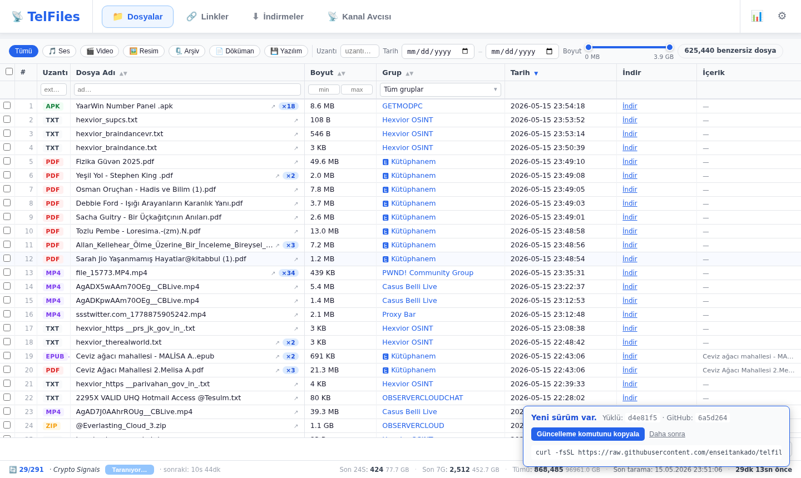
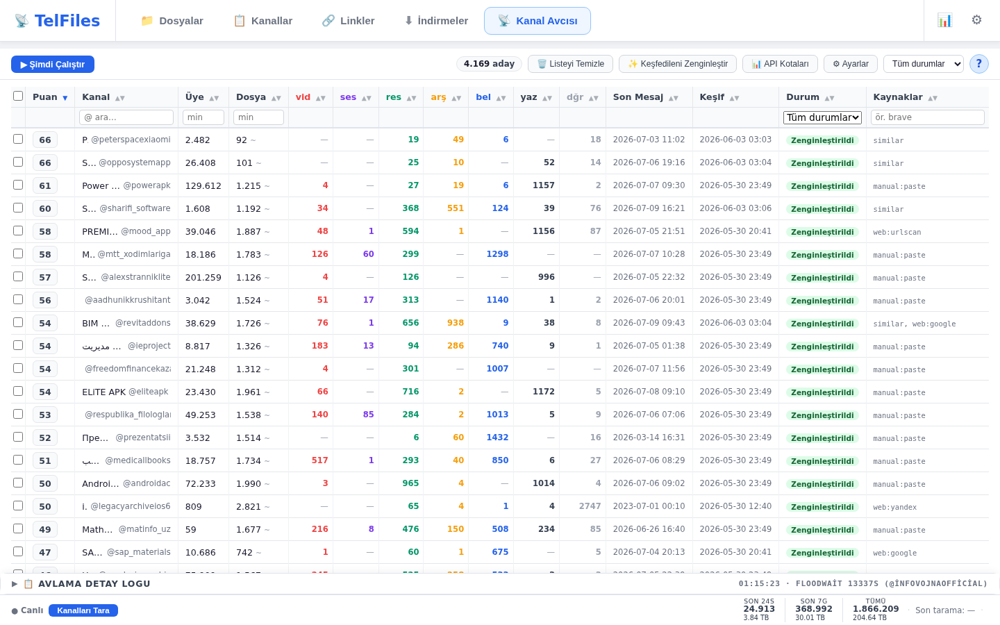
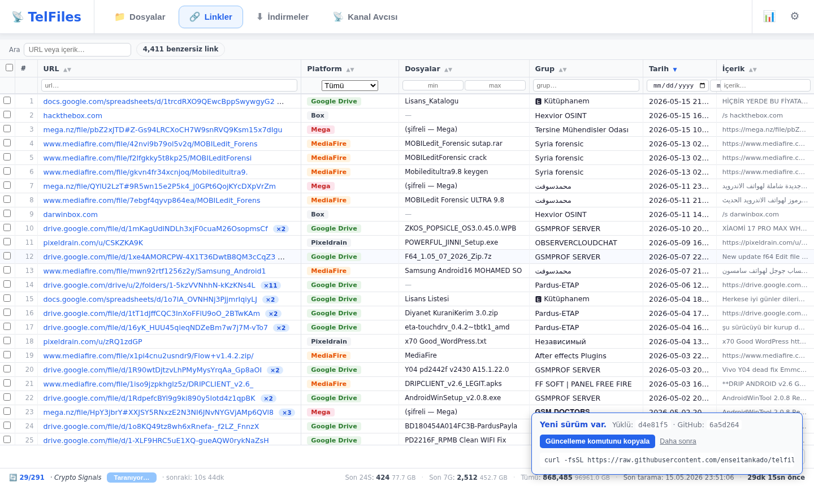
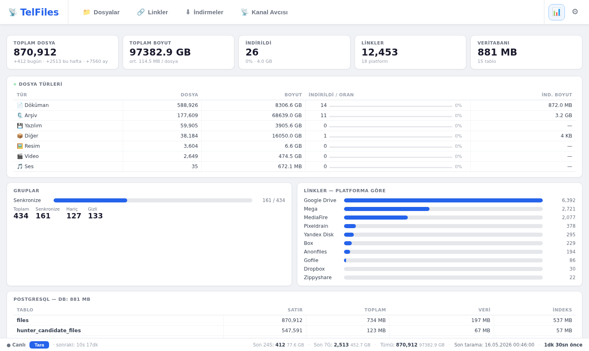
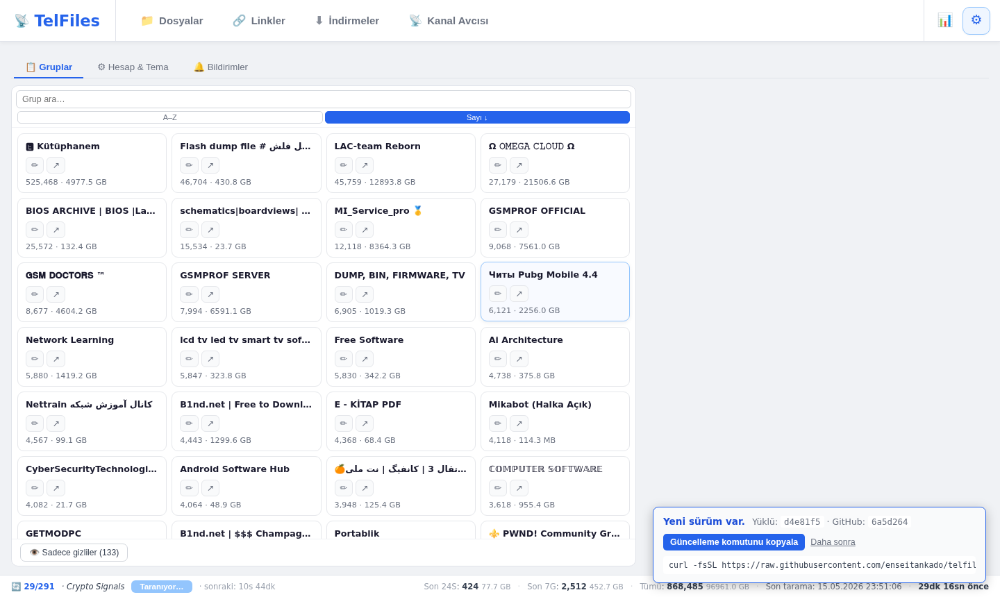

<p align="center">
  
</p>

<p align="center">
  <a href="README.md">🇹🇷 Türkçe</a> &nbsp;|&nbsp;
  <a href="README.en.md">🇬🇧 English</a> &nbsp;|&nbsp;
  <a href="README.de.md">🇩🇪 Deutsch</a> &nbsp;|&nbsp;
  <a href="README.ru.md">🇷🇺 Русский</a> &nbsp;|&nbsp;
  <a href="README.zh.md">🇨🇳 中文</a>
</p>

# TelFiles

**Kendi Telegram hesabınızla** üye olduğunuz grup ve kanalları arka planda gezer; karşılaştığı her dosyayı ve her bağlantıyı yerel bir PostgreSQL veritabanında indeksler. Tarayıcıdan açtığınız tek bir arayüzden arar, sıralar, filtreler ve istediğinizi tek tıkla bilgisayarınıza indirirsiniz.

Bonus: **Kanal Avcısı** — dosya bakımından zengin yeni kanalları arar, puanlar ve önünüze getirir.

```bash
curl -fsSL https://raw.githubusercontent.com/enseitankado/telfiles/main/install.sh | bash
```

> Debian / Ubuntu / Kali / Pardus / Mint. Tek satır; Docker yoksa kurar, container'ları ayağa kaldırır, erişim URL'sini yazdırır.

---

## ✨ Öne çıkan özellikler

- **Çok hesap** — birden fazla Telegram hesabını tek görünümde birleştirir.
- **Tam arşiv erişimi** — geçmiş mesajları sayfa sayfa tarar, yeni gelenleri realtime yakalar.
- **Dosyalar & Linkler & Kanallar için ayrı grid'ler** — kolon başına sıralama + filtre, kanal/tip/boyut/tarih bazlı daraltma; Kanallar sekmesinde üye sayısı, dosya sayısı, toplu işlemler.
- **Torrent içerik indeksi** — `.torrent` dosyaları otomatik parse edilir; içindeki dosya yolları veritabanına eklenir ve dosyalar sekmesinden tam metin aramasına dahil olur.
- **İndirmeler & Transfer** — indirilen dosyalar geçmiş sekmesinde listelenir. Yerelde depolanan dosyalar FTP, SFTP veya yerel dizine (NAS / harici disk) otomatik kopyalanır ya da taşınır. **Bant genişliği zamanlama** ile büyük dosyalar yalnızca belirlediğiniz saatlerde indirilir.
- **Kanal Avcısı** — 3 aşamalı keşif: (1) iç linklerden mining, (2) 22+ web kaynağı (TGStat, Telemetr.io, Combot, t-do.ru, telega.io + arama motorları + Reddit / HN / GitHub + web arşivleri), (3) Telegram'dan örnek mesaj sample'ıyla zenginleştirme & skorlama. Sütun başına sunucu taraflı sıralama; geçici üyelik ile kısıtlı kanalları tarama; 1 yıldan eski kanalları otomatik atlama.
- **Önce dene, sonra karar ver** — aday kanalın belirli bir dosyasını **üye olmadan** önizleyip indirir; sadece gerekirse onay vererek "temp-join → indir → ayrıl" yapar.
- **Magnet bağlantıları** — `magnet:` URI'ları parse edilir, meta veri (başlık, boyut, tracker listesi) çekilir; backfill ile mevcut bağlantılar toplu güncellenir.
- **İzleme kelimeleri** — `fatura 2025` gibi terim setleri tanımlarsınız; eşleşen dosya geldiğinde bildirim oluşur (AND mantığı, dosya-adı bazlı).
- **PWA** — tarayıcıdan "Uygulamayı yükle" ile mobil veya masaüstüne kurulabilir; çevrimdışı temel UI destekli.
- **Anonim telemetri** — opsiyonel, sadece kanal username + üye sayısı + dosya sayısı; mesaj/IP/kimlik yok. Tek tık kapatılır.
- **5 dil** — Türkçe, English, Deutsch, Русский, 中文.
- **Tek `up -d`** — Docker Compose. Veriler host volume'unda; container'ı silseniz veriniz kalır.

---

## 📸 Ekran görüntüleri

<table>
<tr>
<td width="50%"><a href="docs/screenshots/tr/02-files.png"></a><br><b>📁 Dosyalar</b> — tüm hesaplardan birleştirilmiş arama, tip kategorileri, kanal filtresi, boyut slider'ı; torrent içerik genişletme.</td>
<td width="50%"><a href="docs/screenshots/tr/03-hunter.png"></a><br><b>📡 Kanal Avcısı</b> — keşif pipeline'ı, sunucu taraflı sıralama, detay lightbox'ında dosya önizleme ve indirme.</td>
</tr>
<tr>
<td><a href="docs/screenshots/tr/04-links.png"></a><br><b>🔗 Linkler</b> — Google Drive / Mega / MediaFire vb. platformlardan parse edilen URL'ler, magnet meta verisi, erişilebilirlik kontrolü.</td>
<td><a href="docs/screenshots/tr/06-status.png"></a><br><b>📊 Durum</b> — sync metrikleri, dosya türü dağılımı, platform-bazlı link istatistikleri, RAM / disk kullanımı.</td>
</tr>
<tr>
<td colspan="2" align="center"><a href="docs/screenshots/tr/05-settings.png"></a><br><b>⚙️ Ayarlar</b> — grup yönetimi, transfer hedefleri, bant genişliği zamanlama, izleme kelimeleri, dil & tema, parola.</td>
</tr>
</table>

---

## 🚀 Hızlı başlangıç

**Gereken:** Debian tabanlı Linux + [my.telegram.org](https://my.telegram.org) üzerinden alınmış `API_ID` & `API_HASH`.

```bash
# 1) Tek satırlık kurulum
curl -fsSL https://raw.githubusercontent.com/enseitankado/telfiles/main/install.sh | bash

# 2) Scripted (CI / hazır env)
TELEGRAM_API_ID=12345 TELEGRAM_API_HASH=abcdef… NONINTERACTIVE=1 \
  bash -c "$(curl -fsSL https://raw.githubusercontent.com/enseitankado/telfiles/main/install.sh)"

# 3) Manuel
git clone https://github.com/enseitankado/telfiles.git && cd telfiles
cp .env.example .env && $EDITOR .env       # API_ID + API_HASH
docker compose up -d --build
```

Açılış adresi terminale basılır (varsayılan: `http://<host>:8765`). Port doluysa installer otomatik olarak boş bir sonrakine geçer.

### İlk giriş — iki aşamalı

1. **Arabirim parolası** — `admin` ile gir, **Ayarlar → Hesap → Arabirim Parolası**'ndan değiştir.
2. **Telegram hesabı** — Ayarlar → Hesap → ➕ Hesap Ekle → telefon → Telegram'a düşen kod → (varsa) 2FA. Bağlantı kurulunca tarama otomatik başlar.

> `TELEGRAM_API_ID` / `TELEGRAM_API_HASH` boşsa "Kod gönder" çalışmaz. `.env` dosyasını doldurup `docker compose restart telfiles-app` yeter.

### Güncelleme

Aynı kurulum komutunu tekrar çalıştırın. Installer kendi kendini günceller, kodu çeker, container'ı yeniden inşa eder; **`data/` ve `pgdata/` korunur**.

Program açılışta GitHub'daki HEAD'i kontrol eder, yeni sürüm varsa UI'da bildirir.

**Veritabanı şema migrasyonları** her başlangıçta otomatik uygulanır. `schema_migrations` tablosu hangi versiyonların çalıştırıldığını takip eder. Eklemeli değişiklikler (yeni tablo, yeni kolon) idempotent ve her zaman güvenlidir. Kırıcı değişiklikler (kolon tipi değişikliği, yeniden adlandırma, silme) versiyonlu migrasyonlardır; her biri kendi transaction'ında çalışır — biri başarısız olursa uygulama başlamayı reddeder ve veriye dokunulmadan önce harekete geçebilmeniz için hatayı log'a yazar.

---

## ⚙️ Yapılandırma

| Konum | İçerik | Sıfırlama |
|---|---|---|
| `data/ui_auth.json` | UI parola hash'i + oturum token'ları | sil → `admin` döner |
| `data/credentials.json` | Telegram API kimlikleri (env'den önce gelir) | sil → `.env`'e düşer |
| `data/settings.json` | `sync_interval_seconds` (clamp `[900, 86400]`) | sil → 7200s |
| `data/accounts/{id}/telfiles.session` | Telethon hesap oturumu | sil → o hesap için yeniden giriş |
| `data/hunter_events.jsonl` | Avcı detay log'u (restart'a dayanıklı) | sil → log temizlenir |
| `downloads/` | İndirilen dosyalar (`<grup>/...` ve `_hunter/<kanal>/...`) | her dosya bağımsız silinebilir |
| `pgdata/` | PostgreSQL ana veritabanı | silmeyin |

### Ortam değişkenleri (`.env`)

| Değişken | Zorunlu | Not |
|---|---|---|
| `TELEGRAM_API_ID` | ✅ | my.telegram.org → API Development Tools |
| `TELEGRAM_API_HASH` | ✅ | aynı yer |
| `TELEMETRY_SECRET` | ❌ | Sadece kendi telemetri sunucunuzu kuruyorsanız |

---

## 🧱 Yığın

| Katman | Teknoloji |
|---|---|
| Backend | Python 3.12 · FastAPI · Uvicorn · asyncio |
| Telegram | [Telethon](https://github.com/LonamiWebs/Telethon) (MTProto) |
| Veri | PostgreSQL 16 · asyncpg · pgvector |
| Web scraping | aiohttp + [CloakBrowser](https://github.com/cloakbrowser) (stealth Chromium, Stage 2 için) |
| Frontend | Vanilla JS · CSS · HTML (build adımı yok) |
| Dağıtım | Docker Compose |

Konteyner imajı **~302 MB**. Tüm runtime state host volume'larında.

---

## 🗂️ Proje yapısı

```
app/
├── main.py              # FastAPI + endpoint'ler + arka plan döngüleri
├── database.py          # asyncpg veri katmanı + şema migrasyonları
├── telegram_client.py   # Çok-hesap Telethon yönetimi
├── sync.py              # Geçmiş + realtime mesaj tarayıcısı
├── hunter.py            # Kanal Avcısı pipeline + per-dosya indirme
├── link_prober.py       # Bağlantı erişilebilirlik kontrolcüsü
├── transfer.py          # FTP / SFTP / yerel dizin transfer motoru
├── embed.py             # pgvector semantik gömme API'si
├── embed_worker.py      # Arka plan embedding işçisi
├── magnet_metadata.py   # Magnet URI meta veri çekici
├── torrent_parse.py     # .torrent dosya ayrıştırıcı
├── telemetry.py         # Anonim istatistik gönderici
├── ui_auth.py           # Web parolası + oturum
└── static/              # index.html, app.js, i18n.js — single-page UI

docs/
├── banner.png           # README başlığı
├── screenshots/         # UI ekran görüntüleri (dil klasörleri: tr/en/de/ru/zh)
└── OPERATOR.md          # DB sorguları, sorun giderme, hunter kaynakları
```

---

## 🛠️ Geliştirme

```bash
# Backend (Python) değişikliği → rebuild gerekir
docker compose up -d --build telfiles-app

# Frontend (HTML/JS/CSS) → bind-mount; sadece tarayıcıyı yenile
# app/static/* host'tan canlı serve edilir

# Loglar / DB
docker logs -f telfiles-app
docker exec -it telfiles-postgres psql -U telfiles -d telfiles
```

Daha fazlası: [docs/OPERATOR.md](docs/OPERATOR.md) — DB sorguları, kanal avcısı kaynak listesi, yaygın sorun → çözüm tablosu.

---

## 🔒 Mahremiyet & Telemetri

Etkinleştirildiğinde **24 saatte bir**, sadece şu üç alan gönderilir:

- Üye olduğunuz kanalların **username**'i (zaten herkese açık Telegram bilgisi)
- Her kanalın **üye sayısı** (yine herkese açık)
- O kanaldan indekslediğiniz **dosya sayısı**

**Gönderilmez:** mesajlar, dosya adları, dosya içerikleri, telefon numarası, hesap bilgisi, IP.

Tanımlayıcı: kurulumda yerel üretilen rastgele bir UUID. Kapatmak: Ayarlar → Hesap → "Kullanıcı istatistiklerini gönder" checkbox'ı.

Kendi alıcı endpoint'inizi kullanmak için `app/telemetry.py` içindeki `ENDPOINT_URL`'i değiştirin.

---

## 🤝 Sorun bildirimi & katkı

[GitHub Issues](https://github.com/enseitankado/telfiles/issues) üzerinden.

---

## ⚖️ Lisans

Bu proje açık kaynaktır; lisans dosyası ekleninceye kadar tüm hakları yazara aittir. Fork / değişiklik / yeniden dağıtım için lütfen iletişime geçin.

---

## ⚠️ Sorumluluk reddi

TelFiles yalnızca **sizin Telegram hesabınızla zaten erişebildiğiniz** içeriği yerel olarak indeksler. Telegram [Hizmet Şartları](https://telegram.org/tos)'na uygun kullanım kullanıcının sorumluluğundadır. Yazar(lar), aracın kötüye kullanımından doğacak sonuçlardan sorumlu değildir.
