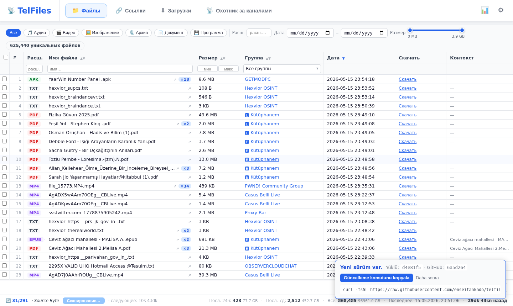
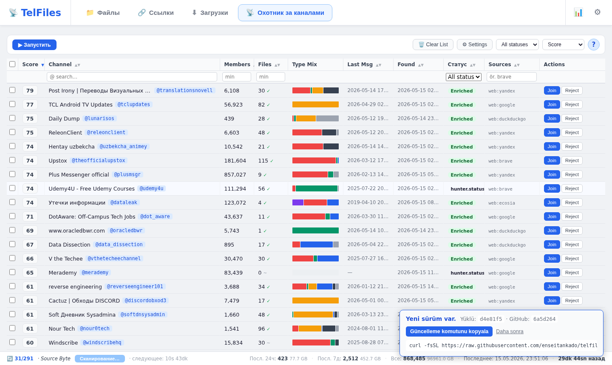
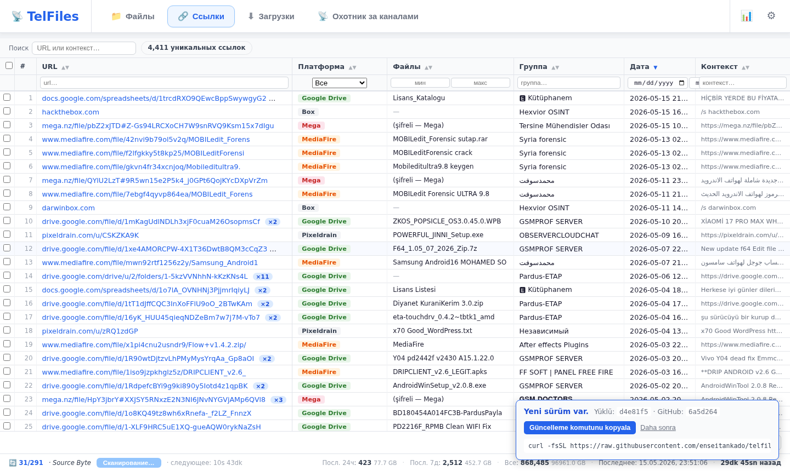
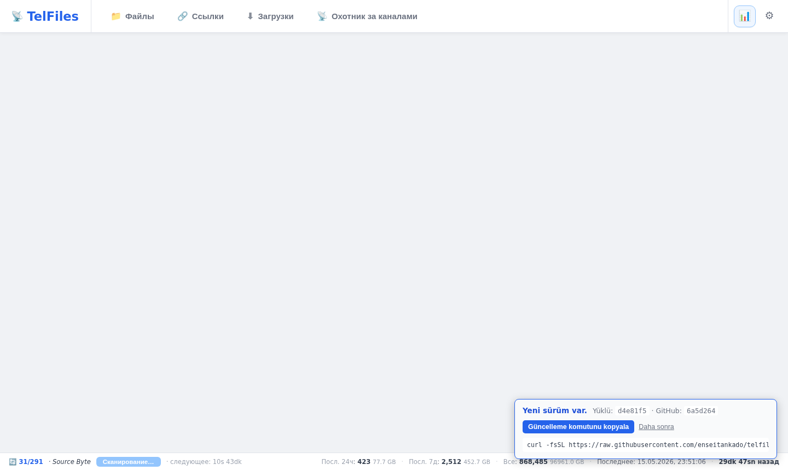
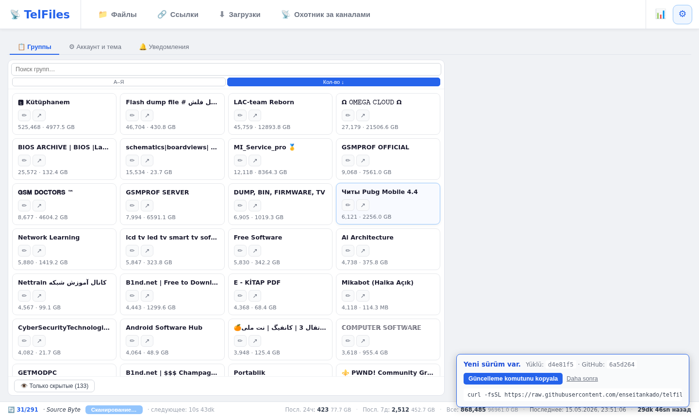

<p align="center">
  
</p>

<p align="center">
  <a href="README.md">🇹🇷 Türkçe</a> &nbsp;|&nbsp;
  <a href="README.en.md">🇬🇧 English</a> &nbsp;|&nbsp;
  <a href="README.de.md">🇩🇪 Deutsch</a> &nbsp;|&nbsp;
  <a href="README.ru.md">🇷🇺 Русский</a> &nbsp;|&nbsp;
  <a href="README.zh.md">🇨🇳 中文</a>
</p>

# TelFiles

Используя **ваш собственный аккаунт Telegram**, в фоновом режиме обходит все группы и каналы, на которые вы подписаны; индексирует каждый найденный файл и каждую ссылку в локальной базе данных PostgreSQL. Ищите, сортируйте, фильтруйте и скачивайте всё, что нужно, одним кликом через единый браузерный интерфейс.

Бонус: **Охотник за каналами** — находит новые каналы с богатым содержимым, оценивает их и предлагает лучшие.

```bash
curl -fsSL https://raw.githubusercontent.com/enseitankado/telfiles/main/install.sh | bash
```

> Debian / Ubuntu / Kali / Pardus / Mint. Одна строка; устанавливает Docker при его отсутствии, запускает контейнеры и выводит URL доступа.

---

## ✨ Основные возможности

- **Мультиаккаунт** — объединяет несколько аккаунтов Telegram в едином интерфейсе.
- **Полный доступ к архиву** — постранично обходит историю и захватывает новые сообщения в реальном времени.
- **Отдельные таблицы для файлов и ссылок** — сортировка + фильтры по столбцам, сужение по каналу / типу / размеру / дате.
- **Охотник за каналами** — 3-этапное обнаружение: (1) добыча из внутренних ссылок, (2) 22 веб-источника (TGStat, Telemetr.io, Combot, t-do.ru, telega.io + 8 поисковиков + Reddit / HN / GitHub), (3) обогащение и оценка с образцами сообщений из Telegram.
- **Сначала попробуй, потом решай** — просмотр и скачивание конкретного файла из канала-кандидата **без вступления**; операция "temp-join → скачать → выйти" выполняется только при явном подтверждении.
- **Ключевые слова наблюдения** — задайте наборы слов вроде `счёт 2025`; при совпадении с именем входящего файла создаётся уведомление (логика AND, по имени файла).
- **Анонимная телеметрия** — опционально; только имя пользователя канала + количество участников + количество файлов. Никаких сообщений, IP-адресов или идентификаторов. Отключается одним кликом.
- **5 языков** — Türkçe, English, Deutsch, Русский, 中文.
- **Один `up -d`** — Docker Compose. Данные хранятся в хост-томах; удаление контейнера не затрагивает ваши данные.

---

## 📸 Скриншоты

<table>
<tr>
<td width="50%"><a href="docs/screenshots/ru/02-files.png"></a><br><b>📁 Файлы</b> — единый поиск по всем аккаунтам, категории типов, фильтр каналов, ползунок размера.</td>
<td width="50%"><a href="docs/screenshots/ru/03-hunter.png"></a><br><b>📡 Охотник за каналами</b> — конвейер обнаружения, сортировка по столбцам, предпросмотр файлов в лайтбоксе деталей.</td>
</tr>
<tr>
<td><a href="docs/screenshots/ru/04-links.png"></a><br><b>🔗 Ссылки</b> — URL-адреса, извлечённые из Google Drive / Mega / MediaFire и др., с проверкой доступности.</td>
<td><a href="docs/screenshots/ru/06-status.png"></a><br><b>📊 Статус</b> — метрики синхронизации, распределение по типам файлов, статистика ссылок по платформам, использование RAM / диска.</td>
</tr>
<tr>
<td colspan="2" align="center"><a href="docs/screenshots/ru/05-settings.png"></a><br><b>⚙️ Настройки</b> — управление группами, ключевые слова наблюдения, язык и тема, пароль.</td>
</tr>
</table>

---

## 🚀 Быстрый старт

**Требования:** Linux на базе Debian + `API_ID` и `API_HASH` с [my.telegram.org](https://my.telegram.org).

```bash
# 1) Установка одной строкой
curl -fsSL https://raw.githubusercontent.com/enseitankado/telfiles/main/install.sh | bash

# 2) Скриптовый режим (CI / преднастроенная среда)
TELEGRAM_API_ID=12345 TELEGRAM_API_HASH=abcdef… NONINTERACTIVE=1 \
  bash -c "$(curl -fsSL https://raw.githubusercontent.com/enseitankado/telfiles/main/install.sh)"

# 3) Вручную
git clone https://github.com/enseitankado/telfiles.git && cd telfiles
cp .env.example .env && $EDITOR .env       # API_ID + API_HASH
docker compose up -d --build
```

URL доступа выводится в терминал (по умолчанию: `http://<хост>:8765`). Если порт занят, установщик автоматически выбирает следующий свободный.

### Первый вход — два шага

1. **Пароль интерфейса** — войдите с `admin`, затем смените пароль в **Настройки → Аккаунт → Пароль интерфейса**.
2. **Аккаунт Telegram** — Настройки → Аккаунт → ➕ Добавить аккаунт → телефон → код из Telegram → (если включена) 2FA. Сканирование начнётся автоматически после подключения.

> Если `TELEGRAM_API_ID` / `TELEGRAM_API_HASH` пусты, кнопка "Отправить код" не работает. Заполните `.env` и выполните `docker compose restart telfiles-app`.

### Обновление

Запустите тот же установочный скрипт повторно. Установщик обновит себя, скачает последний код, пересоберёт контейнер; **`data/` и `pgdata/` сохраняются**.

При запуске приложение проверяет HEAD на GitHub и уведомляет об обновлении через интерфейс.

---

## ⚙️ Конфигурация

| Расположение | Содержимое | Сброс |
|---|---|---|
| `data/ui_auth.json` | Хэш пароля + токены сессий | удалить → вернётся `admin` |
| `data/credentials.json` | Данные API Telegram (приоритет над env) | удалить → откат к `.env` |
| `data/settings.json` | `sync_interval_seconds` (ограничено `[900, 86400]`) | удалить → 7200s |
| `data/accounts/{id}/telfiles.session` | Сессия аккаунта Telethon | удалить → повторный вход для этого аккаунта |
| `data/hunter_events.jsonl` | Детальный лог охотника (устойчив к перезапуску) | удалить → лог очищается |
| `downloads/` | Скачанные файлы (`<группа>/...` и `_hunter/<канал>/...`) | каждый файл можно удалить независимо |
| `pgdata/` | Основная база данных PostgreSQL | не удалять |

### Переменные окружения (`.env`)

| Переменная | Обязательно | Примечание |
|---|---|---|
| `TELEGRAM_API_ID` | ✅ | my.telegram.org → API Development Tools |
| `TELEGRAM_API_HASH` | ✅ | там же |
| `TELEMETRY_SECRET` | ❌ | Только если запускаете собственный сервер телеметрии |

---

## 🧱 Стек

| Слой | Технология |
|---|---|
| Backend | Python 3.12 · FastAPI · Uvicorn · asyncio |
| Telegram | [Telethon](https://github.com/LonamiWebs/Telethon) (MTProto) |
| Данные | PostgreSQL 16 · asyncpg |
| Веб-скрейпинг | aiohttp + [CloakBrowser](https://github.com/cloakbrowser) (stealth Chromium, этап 2) |
| Frontend | Vanilla JS · CSS · HTML (без этапа сборки) |
| Деплой | Docker Compose |

Образ контейнера **~302 МБ**. Всё состояние рантайма в хост-томах.

---

## 🗂️ Структура проекта

```
app/
├── main.py              # FastAPI + эндпоинты + 4 фоновых цикла
├── database.py          # asyncpg уровень данных + миграции схемы
├── telegram_client.py   # Управление мультиаккаунтами Telethon
├── sync.py              # Сканер истории + сообщений реального времени
├── hunter.py            # Конвейер охотника за каналами + скачивание файлов
├── link_prober.py       # Проверщик доступности ссылок
├── telemetry.py         # Отправщик анонимной статистики
├── ui_auth.py           # Веб-пароль + сессия
└── static/              # index.html, app.js, i18n.js — single-page UI

docs/
├── banner.png           # Шапка README
├── screenshots/         # Скриншоты UI (папки по языкам: tr/en/de/ru/zh)
└── OPERATOR.md          # DB-запросы, устранение неполадок, источники охотника
```

---

## 🛠️ Разработка

```bash
# Изменение backend (Python) → требует пересборки
docker compose up -d --build telfiles-app

# Frontend (HTML/JS/CSS) → bind-mount; просто обновите браузер
# app/static/* обслуживается напрямую с хоста

# Логи / DB
docker logs -f telfiles-app
docker exec -it telfiles-postgres psql -U telfiles -d telfiles
```

Подробнее: [docs/OPERATOR.md](docs/OPERATOR.md) — DB-запросы, список источников охотника, таблица типичных проблем → решений.

---

## 🔒 Конфиденциальность и телеметрия

При включении **раз в 24 часа** отправляются только эти три поля:

- **Имя пользователя** каналов, на которые вы подписаны (уже публичная информация Telegram)
- **Количество участников** каждого канала (тоже публично)
- **Количество проиндексированных файлов** из этого канала

**Никогда не отправляется:** сообщения, имена файлов, содержимое файлов, номер телефона, данные аккаунта, IP.

Идентификатор: случайный UUID, генерируемый локально при установке. Отключить: Настройки → Аккаунт → снять флажок "Отправлять статистику использования".

Для использования собственного эндпоинта измените `ENDPOINT_URL` в `app/telemetry.py`.

---

## 🤝 Проблемы и вклад в проект

Через [GitHub Issues](https://github.com/enseitankado/telfiles/issues).

---

## ⚖️ Лицензия

Проект является открытым исходным кодом; все права принадлежат автору до добавления файла лицензии. Для форка / изменения / распространения, пожалуйста, свяжитесь с автором.

---

## ⚠️ Отказ от ответственности

TelFiles индексирует только контент, к которому **у вас уже есть доступ через ваш собственный аккаунт Telegram**. Соблюдение [Условий использования](https://telegram.org/tos) Telegram является ответственностью пользователя. Автор(ы) не несут ответственности за последствия неправомерного использования этого инструмента.
