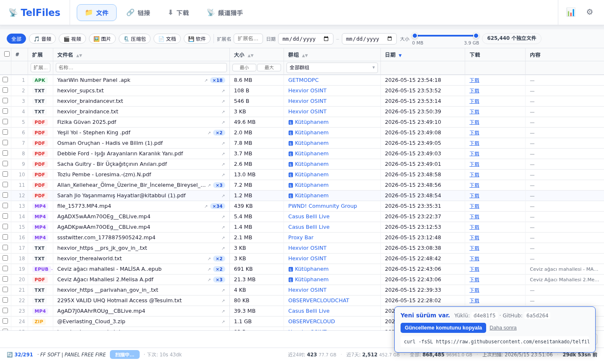
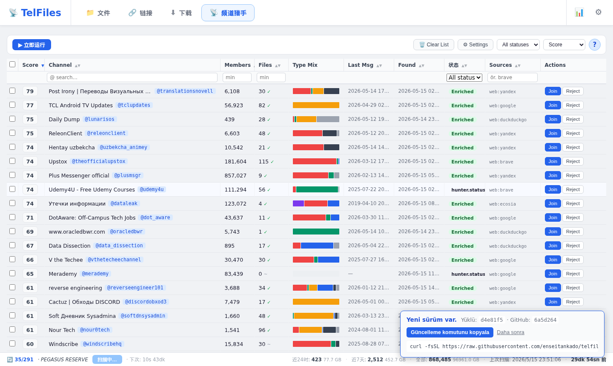
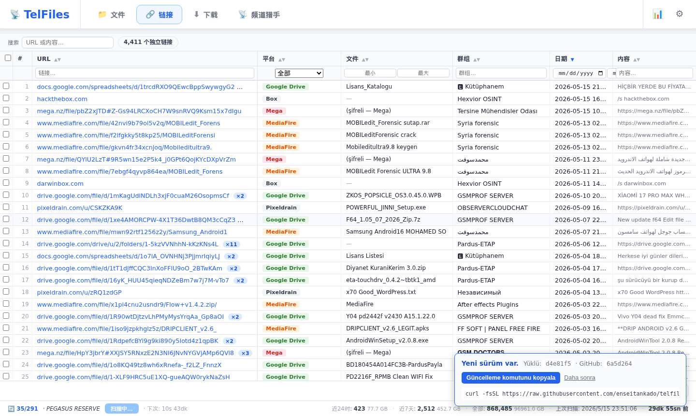
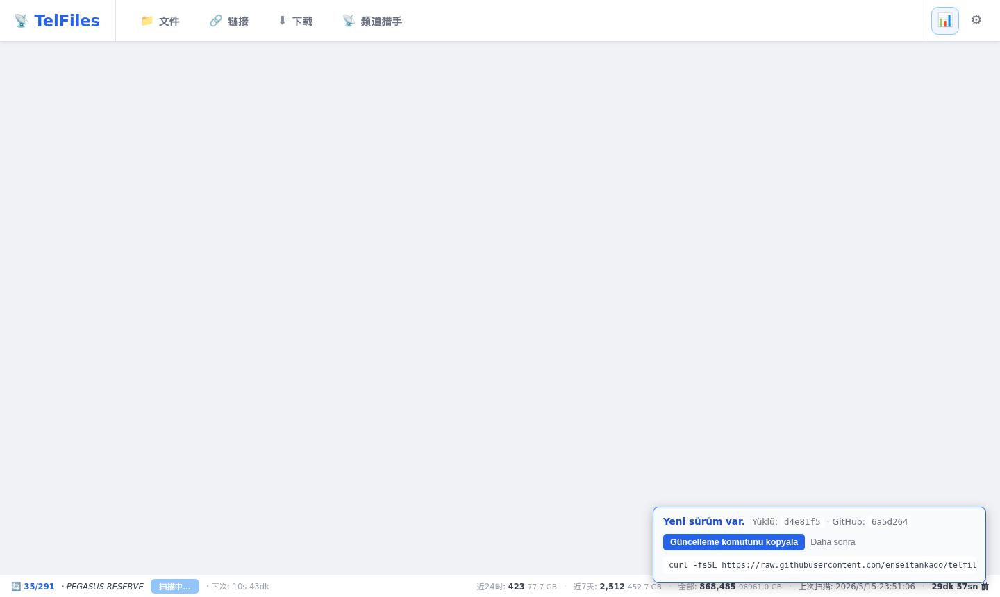
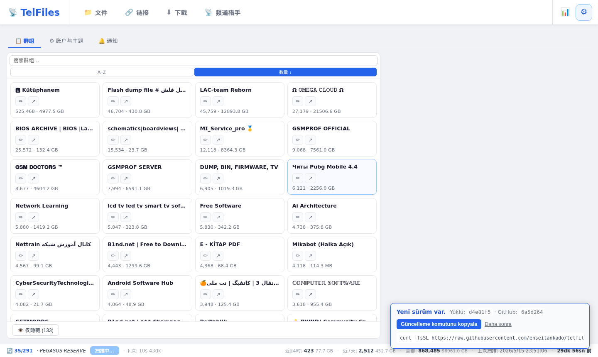

<p align="center">
  
</p>

<p align="center">
  <a href="README.md">🇹🇷 Türkçe</a> &nbsp;|&nbsp;
  <a href="README.en.md">🇬🇧 English</a> &nbsp;|&nbsp;
  <a href="README.de.md">🇩🇪 Deutsch</a> &nbsp;|&nbsp;
  <a href="README.ru.md">🇷🇺 Русский</a> &nbsp;|&nbsp;
  <a href="README.zh.md">🇨🇳 中文</a>
</p>

# TelFiles

使用**您自己的 Telegram 账户**在后台抓取您加入的群组和频道；将遇到的每个文件和每个链接都索引到本地 PostgreSQL 数据库中。通过浏览器中的单一界面进行搜索、排序、筛选，并一键下载所需内容。

附加功能：**频道猎人** — 发现文件丰富的新频道，对其评分并呈现最佳结果。

```bash
curl -fsSL https://raw.githubusercontent.com/enseitankado/telfiles/main/install.sh | bash
```

> Debian / Ubuntu / Kali / Pardus / Mint。一行命令；如未安装 Docker 则自动安装，启动容器并打印访问 URL。

---

## ✨ 主要特性

- **多账户** — 将多个 Telegram 账户合并到单一视图中。
- **完整存档访问** — 分页浏览历史记录，实时捕获新消息。
- **文件和链接的独立表格** — 按列排序 + 筛选，按频道 / 类型 / 大小 / 日期缩小范围。
- **频道猎人** — 三阶段发现：(1) 从内部链接挖掘，(2) 22 个网络来源（TGStat、Telemetr.io、Combot、t-do.ru、telega.io + 8 个搜索引擎 + Reddit / HN / GitHub），(3) 通过 Telegram 示例消息进行丰富和评分。
- **先试后决定** — 无需加入即可预览和下载候选频道中的特定文件；仅在明确批准时才执行"临时加入 → 下载 → 离开"操作。
- **监控关键词** — 定义如 `发票 2025` 的词集；当匹配的文件到达时创建通知（AND 逻辑，基于文件名）。
- **匿名遥测** — 可选；仅包含频道用户名 + 成员数 + 文件数。无消息、IP 或身份信息。一键禁用。
- **5 种语言** — Türkçe、English、Deutsch、Русский、中文。
- **单次 `up -d`** — Docker Compose。数据存储在主机卷中；删除容器不影响您的数据。

---

## 📸 截图

<table>
<tr>
<td width="50%"><a href="docs/screenshots/zh/02-files.png"></a><br><b>📁 文件</b> — 跨所有账户的统一搜索、类型分类、频道筛选、大小滑块。</td>
<td width="50%"><a href="docs/screenshots/zh/03-hunter.png"></a><br><b>📡 频道猎人</b> — 发现流水线、按列排序、在详情灯箱中预览文件。</td>
</tr>
<tr>
<td><a href="docs/screenshots/zh/04-links.png"></a><br><b>🔗 链接</b> — 从 Google Drive / Mega / MediaFire 等解析的 URL，并进行可访问性检查。</td>
<td><a href="docs/screenshots/zh/06-status.png"></a><br><b>📊 状态</b> — 同步指标、文件类型分布、基于平台的链接统计、RAM / 磁盘使用情况。</td>
</tr>
<tr>
<td colspan="2" align="center"><a href="docs/screenshots/zh/05-settings.png"></a><br><b>⚙️ 设置</b> — 群组管理、监控关键词、语言和主题、密码。</td>
</tr>
</table>

---

## 🚀 快速开始

**要求：** 基于 Debian 的 Linux + 来自 [my.telegram.org](https://my.telegram.org) 的 `API_ID` 和 `API_HASH`。

```bash
# 1) 一行安装
curl -fsSL https://raw.githubusercontent.com/enseitankado/telfiles/main/install.sh | bash

# 2) 脚本化（CI / 预配置环境）
TELEGRAM_API_ID=12345 TELEGRAM_API_HASH=abcdef… NONINTERACTIVE=1 \
  bash -c "$(curl -fsSL https://raw.githubusercontent.com/enseitankado/telfiles/main/install.sh)"

# 3) 手动
git clone https://github.com/enseitankado/telfiles.git && cd telfiles
cp .env.example .env && $EDITOR .env       # API_ID + API_HASH
docker compose up -d --build
```

访问 URL 将打印到终端（默认：`http://<主机>:8765`）。如果端口被占用，安装程序会自动选择下一个可用端口。

### 首次登录 — 两步骤

1. **界面密码** — 使用 `admin` 登录，然后在**设置 → 账户 → 界面密码**中更改。
2. **Telegram 账户** — 设置 → 账户 → ➕ 添加账户 → 电话 → Telegram 发来的验证码 → （如已启用）2FA。连接后扫描自动开始。

> 如果 `TELEGRAM_API_ID` / `TELEGRAM_API_HASH` 为空，"发送验证码"将无法工作。填写 `.env` 后运行 `docker compose restart telfiles-app`。

### 更新

再次运行相同的安装命令。安装程序会更新自身，拉取最新代码，重新构建容器；**`data/` 和 `pgdata/` 保持不变**。

启动时，应用程序会检查 GitHub 上的 HEAD，如有新版本则在界面中通知您。

---

## ⚙️ 配置

| 位置 | 内容 | 重置 |
|---|---|---|
| `data/ui_auth.json` | UI 密码哈希 + 会话令牌 | 删除 → 恢复为 `admin` |
| `data/credentials.json` | Telegram API 凭证（优先于 env） | 删除 → 回退到 `.env` |
| `data/settings.json` | `sync_interval_seconds`（限制在 `[900, 86400]`） | 删除 → 7200s |
| `data/accounts/{id}/telfiles.session` | Telethon 账户会话 | 删除 → 该账户需要重新登录 |
| `data/hunter_events.jsonl` | 猎人详细日志（重启安全） | 删除 → 日志清空 |
| `downloads/` | 下载的文件（`<群组>/...` 和 `_hunter/<频道>/...`） | 每个文件可独立删除 |
| `pgdata/` | PostgreSQL 主数据库 | 请勿删除 |

### 环境变量（`.env`）

| 变量 | 必需 | 备注 |
|---|---|---|
| `TELEGRAM_API_ID` | ✅ | my.telegram.org → API Development Tools |
| `TELEGRAM_API_HASH` | ✅ | 同一页面 |
| `TELEMETRY_SECRET` | ❌ | 仅在运行自己的遥测服务器时需要 |

---

## 🧱 技术栈

| 层级 | 技术 |
|---|---|
| 后端 | Python 3.12 · FastAPI · Uvicorn · asyncio |
| Telegram | [Telethon](https://github.com/LonamiWebs/Telethon) (MTProto) |
| 数据 | PostgreSQL 16 · asyncpg |
| 网页抓取 | aiohttp + [CloakBrowser](https://github.com/cloakbrowser)（隐身 Chromium，阶段 2） |
| 前端 | 原生 JS · CSS · HTML（无构建步骤） |
| 部署 | Docker Compose |

容器镜像 **~302 MB**。所有运行时状态存储在主机卷中。

---

## 🗂️ 项目结构

```
app/
├── main.py              # FastAPI + 端点 + 4 个后台循环
├── database.py          # asyncpg 数据层 + 模式迁移
├── telegram_client.py   # 多账户 Telethon 管理
├── sync.py              # 历史 + 实时消息扫描器
├── hunter.py            # 频道猎人流水线 + 文件下载
├── link_prober.py       # 链接可访问性检查器
├── telemetry.py         # 匿名统计发送器
├── ui_auth.py           # 网页密码 + 会话
└── static/              # index.html, app.js, i18n.js — 单页 UI

docs/
├── banner.png           # README 标题
├── screenshots/         # UI 截图（按语言分文件夹：tr/en/de/ru/zh）
└── OPERATOR.md          # DB 查询、故障排除、猎人来源
```

---

## 🛠️ 开发

```bash
# 后端 (Python) 更改 → 需要重新构建
docker compose up -d --build telfiles-app

# 前端 (HTML/JS/CSS) → bind-mount；只需刷新浏览器
# app/static/* 直接从主机提供服务

# 日志 / DB
docker logs -f telfiles-app
docker exec -it telfiles-postgres psql -U telfiles -d telfiles
```

更多信息：[docs/OPERATOR.md](docs/OPERATOR.md) — DB 查询、猎人来源列表、常见问题 → 解决方案表。

---

## 🔒 隐私与遥测

启用后，**每 24 小时**仅发送以下三个字段：

- 您加入频道的**用户名**（已是公开的 Telegram 信息）
- 每个频道的**成员数量**（同样公开）
- 您从该频道索引的**文件数量**

**从不发送：** 消息、文件名、文件内容、电话号码、账户信息、IP。

标识符：安装时本地生成的随机 UUID。禁用方法：设置 → 账户 → 取消勾选"发送使用统计"。

如需使用自己的接收端点，修改 `app/telemetry.py` 中的 `ENDPOINT_URL`。

---

## 🤝 问题与贡献

通过 [GitHub Issues](https://github.com/enseitankado/telfiles/issues)。

---

## ⚖️ 许可证

本项目为开源项目；在添加许可证文件之前，所有权利归作者所有。Fork / 修改 / 再发行请联系作者。

---

## ⚠️ 免责声明

TelFiles 仅索引您**已通过自己的 Telegram 账户可访问**的内容。遵守 Telegram [服务条款](https://telegram.org/tos) 是用户的责任。作者不对因滥用本工具而产生的任何后果承担责任。
